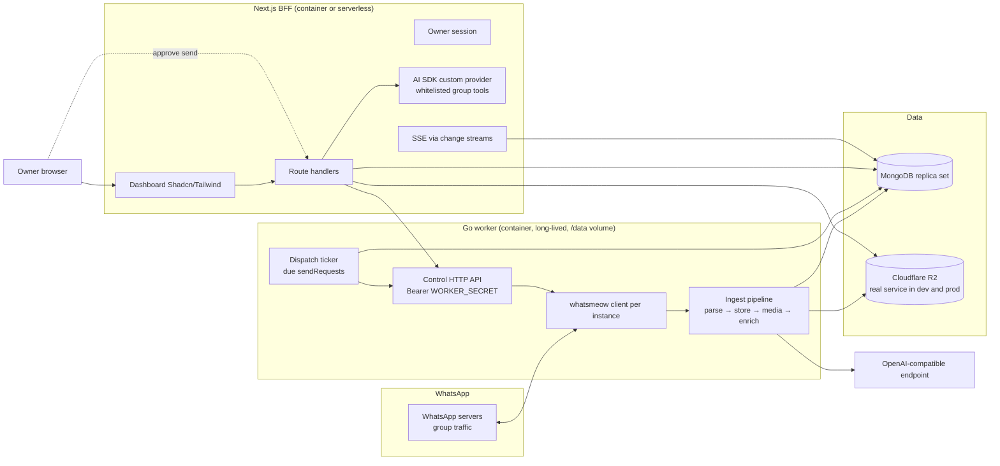
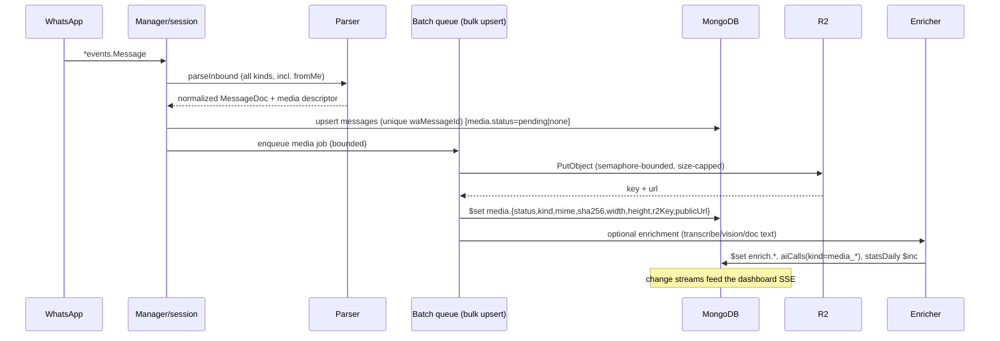
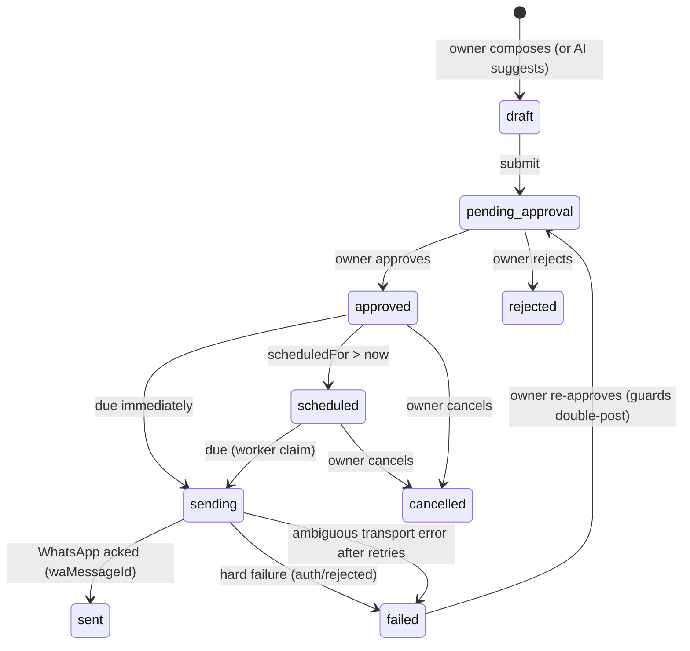

# Group Butler — Architecture Draft

Status: **proposal, implementation-ready**. No product code exists yet; this document is the
deliverable and the single source of truth for the first implementation pass.

Scope: a WhatsApp **group butler** monorepo — ingest every activity in every group a linked
account participates in, store/search the raw messages, download and read media when possible,
record media that cannot be read together with its declared type and R2 object, answer AI group
questions strictly inside a per-instance JID whitelist, send messages only after human approval
(immediately or on a schedule), and report bot / group / token statistics. The BFF and the worker
are separately deployable containers published to GHCR. Development runs against a local Docker
**MongoDB replica set** and a **real Cloudflare R2 bucket** — there is no local S3 emulator anywhere
in this project — and production images have **no docker-compose dependency**.

Audience: the implementing agents/engineers. Everything below (collection shapes, index keys, env
names, endpoint paths, file layout, image names) is intended to be transcribed directly.

---

## 1. Requirements → design traceability

| # | Requirement | Where it is satisfied |
|---|---|---|
| R1 | Ingest **every** group activity | Worker `handleEvent` → `onMessage` (no mention gate); `messages` upserted for all kinds incl. `fromMe`; §5.1, §6.2 |
| R2 | Download/read media when possible | Worker media pipeline: download → R2 → metadata → optional enrichment (transcribe/vision/doc-extract); §6.3, §9 |
| R3 | Record unparseable media with type + R2 link | `messages.media = {status:'unparsed', declaredType, r2Key, publicUrl, reason}`; §6.3.4 |
| R4 | Searchable raw messages | `messages.text` + `textSearch` + `rawSearch` (flattened from the raw proto tree) + Mongo text index and compound filters; §5.1, §6.4 |
| R5 | AI queries restricted by per-instance JID whitelist | `instances.config.groupJidWhitelist`; whitelist closed over inside AI tool implementations **and** enforced in the Mongo filter; §7, §11.3 |
| R6 | Multi-instance; instance → many groups | `instances` 1—N `groups` (`{organizationId, instanceId, groupJid}` unique); assignment in `groups.config.assigned`; §5.1 |
| R7 | User-approved immediate/scheduled sends | `sendRequests` state machine, human approval gate, worker dispatch ticker with lock + idempotency key; §8 |
| R8 | Bot/group/token statistics | `statsDaily` rollups + live `instances.runtime.counters` + `aiCalls`; §10 |
| R9 | Separately deployable BFF/worker → GHCR | Two Dockerfiles, two image names, independent env contracts, `deploy.yml` buildx matrix; §12 |
| R10 | Local Docker Mongo + real R2 in dev, no compose in prod | `infra/dev/docker-compose.yml` starts the MongoDB replica set **only**; media uses a real Cloudflare R2 bucket in every environment; prod = `docker run` of published images, optional pull-only compose sample; §13 |
| R11 | Dashboard shows every instance's **group ID + current group name** | `groups.observed.subject` persisted by worker group discovery/sync (`GetJoinedGroups` + `events.JoinedGroup`/`events.GroupInfo`); BFF read model `/api/instances/[id]/groups`; §6.6, §7.3, §7.5, TDD slices T1–T14 |

---

## 2. Assumptions (explicit)

These are decisions taken in the absence of contrary instruction. Each is a boundary the
implementation may not silently cross.

1. **Internal, single-operator tool.** The dashboard has exactly **one** owner account
   authenticated by email/password supplied via environment variables. There is no signup, no
   invitation, no password reset, no OAuth, no SSO, and **no trusting of proxy headers**
   (`X-Forwarded-User`, `X-Auth-Request-*`, …) for identity. Multi-user roles are explicitly out
   of scope. See §11.1.
2. **Future tenancy boundary is preserved, not implemented.** Every tenant-scoped document
   carries `organizationId: string`, defaulting to `org_default`. All data accessors take
   `organizationId` as an argument and every query filters on it. There is one organization row,
   seeded idempotently; no role model, no membership model, no per-tenant UI switching. This
   mirrors the lesson from the sibling deployment (`hallo-zetta`): the tenant column must exist
   and must not be required-in-practice, so background writers keep working.
3. **WhatsApp is reached through `whatsmeow`** (multi-device linked device, unofficial client).
   The linked account must be a participant of a group for that group's traffic to be observable.
   Account-ban risk is accepted and reduced by: never sending without human approval, no bulk
   fan-out, no automation loop.
4. **The worker is a long-lived process** with a persistent volume for `whatsmeow` auth state. It
   may not be serverless. The web BFF is stateless and may run either as a container or on a
   serverless platform.
5. **MongoDB runs as a replica set** (single-node locally, Atlas or self-hosted in production).
   Change streams are the live-update transport. If a deployment cannot provide a replica set,
   the SSE layer degrades to polling — documented in §7.4 — but the default target is RS.
6. **No Redis.** The reference worker's Redis event bus and QR channel are replaced by MongoDB
   (durable ingest writes + change streams + a TTL-backed `pairingSessions` collection). Fewer
   moving parts, one datastore for product data.
7. **Media "unparseable" means we hold bytes but cannot identify/consume them** (unknown
   container, encrypted, corrupt, or unsupported). Those bytes are stored as an opaque object and
   the record carries the declared WhatsApp type plus the R2 locator (R3). Media that cannot be
   **downloaded at all** (view-once already consumed, expired, no media keys) is recorded with its
   declared type and an unavailability reason, and no R2 link — a link cannot exist for bytes we
   never received. View-once capture is a policy decision recorded here as an assumption for an
   internal tool; the implementation must expose a per-instance switch to skip view-once.
8. **One instance = one WhatsApp account.** Many groups per instance. If two instances are both
   members of the same group JID, two independent message streams are stored (keyed by
   `instanceId`); no cross-instance dedupe is attempted beyond the per-instance message ID.
9. **Tooling:** bun workspaces for the JS side (matches the sibling repo's package manager),
   Next.js App Router + React 19 + Tailwind + shadcn/ui, Go 1.25 with `CGO_ENABLED=1` (sqlite auth
   store), all timestamps stored as UTC `Date`/BSON date.
10. **The AI provider is an OpenAI-compatible HTTP endpoint** fronted by a Vercel AI SDK custom
    provider. The AI SDK provider is `@ai-sdk/openai-compatible` unless the endpoint deviates, in
    which case a hand-written `LanguageModelV2` implementation is the fallback. No vendor SDK is
    allowed to leak into domain code. See §7.1.
11. **Docker is a dev convenience, not a production coupling.** Compose is used to start the local
    MongoDB replica set; production runs the two published images directly. A pull-only compose file
    is offered as an operator convenience only and is never required by either image.
12. **Media storage is real Cloudflare R2 in every environment.** There is no MinIO, no local S3
    emulator, no endpoint override and no path-style configuration anywhere in this project, so the
    media path (upload, `unparsed` capture, presigned reads) is exercised against the real service
    from the first day of development. Local development uses a dedicated **dev bucket** with its own
    scoped credentials, never the production bucket (§11.6). The dev launcher validates the five R2
    values and refuses to start with an actionable message when one is missing or left as a
    placeholder (§13).
13. **Out of scope for this draft:** message-level full-text ranking beyond Mongo text indexes,
    vector embeddings, WhatsApp channel/newsletter ingestion, billing, multi-language UI, mobile
    clients, egress-side message templating approval flows (WhatsApp Business API rules).

---

## 3. System context



Trust boundaries (detailed in §11): the owner browser ↔ BFF is the only authenticated user
surface; BFF ↔ worker is a shared-secret machine boundary on a private network; worker ↔ Mongo/R2
uses its own credentials; group message content is **untrusted data** everywhere it flows.

---

## 4. Repository layout

```
group-butler/
├─ apps/
│  ├─ web/                                  # Next.js BFF + dashboard
│  │  ├─ src/app/(dash)/                    # authenticated pages
│  │  ├─ src/app/api/                       # route handlers (the "BFF")
│  │  ├─ src/app/login/                     # unauthenticated login
│  │  ├─ src/middleware.ts                  # session gate
│  │  ├─ src/server/                        # mongo, auth, worker client, ai, stats, media
│  │  ├─ scripts/bootstrap.ts               # idempotent seed (organizations, settings, indexes)
│  │  ├─ next.config.ts                     # output: 'standalone'
│  │  └─ Dockerfile
│  └─ worker/                               # Go whatsmeow worker
│     ├─ main.go  config.go  log.go  id.go
│     ├─ manager.go  lifecycle.go  handler.go
│     ├─ message.go  media.go  enrich.go  r2.go
│     ├─ dispatch.go  mongo.go  groups.go  groupdelta.go
│     ├─ testdata/*.xml                     # captured w:gp2 notification transcripts
│     ├─ *_test.go
│     └─ Dockerfile
├─ packages/
│  └─ shared/                               # zod schemas + TS types for the worker contract
├─ scripts/
│  ├─ dev.sh                                # REQUIRED one-command local dev (§13)
│  └─ dev.test.ts                           # contract tests for scripts/dev.sh + .env.example
├─ infra/
│  ├─ dev/docker-compose.yml                # MongoDB replica set only (dev); R2 is the real service
│  └─ prod/docker-compose.ghcr.yml          # OPTIONAL pull-only sample
├─ docs/{architecture-draft.md,plans/}
├─ .github/workflows/{ci.yml,deploy.yml}
├─ .env.example                             # sourceable local-dev env (no real secrets)
├─ package.json                             # bun workspaces: apps/web, packages/shared
└─ README.md
```

Rules:
- `packages/shared` **must not** be imported by `apps/worker` (Go cannot consume TS). The worker
  contract is HTTP JSON; the Go structs are the reference, `packages/shared/src/worker-contract.ts`
  mirrors them, and zod validates at the BFF boundary (§6.7).
- No `apps/web` code may reach the WhatsApp socket directly. All WhatsApp operations go through
  the worker control API.
- **`scripts/dev.sh` is the only supported local entry point** (a mandatory deliverable, §13). It
  starts infra containers only and runs the web and worker apps as host processes; it must never
  build or run app/worker images.
- **Root `.env.example` is the local-dev contract**: organised sections, commented, sourceable by
  the dev script under `set -a`, safe placeholder values, no real secrets. Service-specific
  deployment examples live beside each app and are not sourced by the script.

---

## 5. Data model (MongoDB)

Eleven collections. Every tenant-scoped document carries `organizationId`. Write ownership is
**one writer per subdocument** — this is a hard rule, because the worker and the BFF both write
Mongo and a shared mutable document would race.

| Collection | Writer of root keys | Writer of subdocuments |
|---|---|---|
| `organizations` | bootstrap | — |
| `instances` | BFF | `config` : BFF · `runtime` : worker |
| `pairingSessions` | worker | — |
| `groups` | BFF | `config` : BFF · `observed`,`stats` : worker |
| `messages` | worker | `media` : worker · — |
| `sendRequests` | BFF | `content`,`approval` : BFF · `dispatch` : worker |
| `aiCalls` | BFF | worker only for `kind:'media_*'` enrichment rows |
| `statsDaily` | worker (live `$inc`) and BFF (recompute `$merge`) | — |
| `auditLog` | BFF and worker | — |
| `appSettings` | BFF | — |
| `streamCursors` | BFF | — |

### 5.1 Collections

#### `organizations`
```
{ _id: "org_default", name: "Default", createdAt: Date }
```
Seeded by `apps/web/scripts/bootstrap.ts`. Never referenced by a foreign key at the DB level;
`organizationId` is a plain string on every other document.

#### `instances`
```
{
  _id: "V1StGXR8_Z5jdHi6B-myT",          // 21-char nanoid-compatible id (see §6.8)
  organizationId: "org_default",
  label: "Support bot",
  mode: "qr" | "code",                    // pairing mode
  config: {                               // ← BFF-owned
    groupJidWhitelist: ["12036304...@g.us"],   // AI query scope (R5)
    aiEnabled: false,
    assignedGroupJids: ["12036304...@g.us"],   // ← mirrors groups.config.assigned (R6)
    autoDownloadMedia: true,
    captureViewOnce: false,
    mediaMaxBytes: 26214400,
    aiMaxTokensPerDay: 200000
  },
  runtime: {                              // ← worker-owned
    status: "disconnected"|"pairing"|"connected"|"logged_out"|"error",
    phoneNumber: "62899...",
    botJid: "62899...@s.whatsapp.net",
    botLid: "123456@lid",
    pairingError: null,
    connectedAt: Date, lastSeenAt: Date,
    counters: { messagesIn, mediaStored, mediaUnparsed, sendOk, sendFailed, aiRejected, groups },
    groupSync: { lastSyncAt: Date, lastError: null, groupsObserved: 12, groupsLeft: 1 },
    ingest:   { queueDepth, droppedTotal, lastFlushAt }
  },
  createdAt, updatedAt, deletedAt: null
}
```
Indexes: `{organizationId:1, label:1}` unique (partial on `deletedAt:null`);
`{organizationId:1, "runtime.status":1}`; `{organizationId:1, deletedAt:1}`.

#### `pairingSessions` (TTL)
Transient pairing material lives outside `instances` so a TTL index can never delete an instance
document.
```
{ _id: "<instanceId>", organizationId, mode, qrDataUrl, pairingCode, error, expiresAt: Date }
```
Index: `{expiresAt:1}` with `expireAfterSeconds: 0`. Written by the worker on every QR rotation;
read by the BFF for the pairing screen.

#### `groups`
Three levels, deliberately distinct:
- **observed** — the account participates; the worker upserts on first traffic / `GetJoinedGroups`.
  Ingestion happens for every observed group (R1).
- **assigned** — the owner opted the group into the managed surface (R6); drives list views and
  allowed send targets.
- **whitelisted** — the group is answerable by the AI for that instance (R5). A subset of assigned.

```
{
  _id, organizationId, instanceId, groupJid: "12036304...@g.us",
  observed: {                             // ← worker-owned (see §6.6)
    subject: "Ops Team",                  // current group name ("" only until first sync)
    subjectSearch: "ops team",            // case-folded, for name search / type-ahead
    subjectUpdatedAt: Date,               // GroupName.NameSetAt (may be zero-valued stamp)
    subjectObservedAt: Date,              // when *we* accepted this value (always set)
    subjectSetBy: "62899...@s.whatsapp.net",   // GroupName.NameSetBy, LID→PN normalized
    subjectSetByLid: "",                  // raw LID when WhatsApp addressed by LID
    subjectSource: "sync"|"event"|"fallback",
    subjectHistory: [                     // capped ring, newest first, max 20 (UI: "renamed 3×")
      { name: "Support", at: Date, by: "..." }
    ],
    topic: "", topicUpdatedAt: Date,
    isAnnounce: false, isLocked: false, isEphemeral: false, isDefaultSubGroup: false,
    participantCount: 12, participantCountDirty: false,
    groupCreatedAt: Date,
    state: "active"|"left"|"deleted"|"suspended",
    lastActivityAt: Date, messageCount: 4211, mediaStored: 88,
    lastSyncedAt: Date, lastSyncSource: "connect"|"timer"|"manual"|"event"|"message"
  },
  config: {                               // ← BFF-owned
    assigned: false,
    whitelisted: false,                   // denormalized mirror of instances.config.groupJidWhitelist
    active: true, notes: "", tags: []
  },
  createdAt, updatedAt
}
```
Indexes: `{organizationId:1, instanceId:1, groupJid:1}` unique;
`{organizationId:1, "config.assigned":1, "observed.lastActivityAt":-1}`;
`{organizationId:1, groupJid:1}` (global "which instances see this group");
`{organizationId:1, instanceId:1, "observed.subjectSearch":1}` (name search per instance);
`{organizationId:1, "observed.state":1, "observed.lastSyncedAt":-1}` (reconciliation sweep).
`config.whitelisted` is written **only** by the whitelist mutation endpoint, in the same
`updateOne` batch that rewrites `instances.config.groupJidWhitelist` — one code path, no drift.
The worker never writes `config.*`; the BFF never writes `observed.*` (§6.6 TDD slice T8).

#### `messages`
```
{
  _id, organizationId, instanceId,
  groupJid, chatJid, isGroup: true,
  waMessageId, senderJid, senderLid, pushName, fromMe: false, deviceId,
  timestamp: Date,                        // WhatsApp Info.Timestamp (UTC)
  receivedAt: Date, serverSkewMs: 0,
  kind: "text"|"image"|"video"|"audio"|"document"|"sticker"|"location"|"contact"
      |"poll"|"reaction"|"system"|"revoked"|"unknown",
  text: "",                               // body or caption, verbatim
  textSearch: "",                         // case-folded, punctuation-stripped
  rawSearch: "",                          // all string leaves of the raw tree, capped (R4)
  links: [""], mentions: ["...@s.whatsapp.net"],
  replyTo: { waMessageId, participant, snippet },
  media: {                                // ← worker-owned; see §6.3
    status: "none"|"pending"|"stored"|"unparsed"|"unavailable"|"failed",
    kind: "image"|"video"|"audio"|"document"|"sticker"|"ptv"|"raw"|null,
    declaredType: "image"|"ptv"|"view_once"|"poll"|"unknown",   // what WhatsApp claimed
    mime, fileName, size, sha256, width, height, durationSec,
    r2Key, publicUrl,
    reason: null|"view_once"|"expired"|"no_keys"|"download_failed"|"unsupported_type"|"too_large",
    error, attempts, updatedAt
  },
  enrich: {                               // ← worker-owned; see §9
    state: "disabled"|"pending"|"done"|"failed",
    kind: "ocr"|"transcript"|"vision_caption"|"doc_text"|null,
    text: "", model: "", tokens: 0, error, updatedAt
  },
  raw: { message: { /* protobuf-derived map */ }, truncated: false, bytes: 812 },
  parse: { state: "ok"|"partial"|"failed", errors: [], version: 1 },
  flags: { edited: false, revoked: false }
}
```
Indexes:
- `{organizationId:1, instanceId:1, waMessageId:1}` **unique** — idempotent ingest.
- `{organizationId:1, instanceId:1, groupJid:1, timestamp:-1}` — group stream.
- `{organizationId:1, "media.status":1, timestamp:-1}` — media reconciliation + "unreadable" view.
- `{organizationId:1, senderJid:1, timestamp:-1}`.
- text index `{text:"text", rawSearch:"text", "media.fileName":"text"}` with
  `default_language:"none"` and weights `{text:10, rawSearch:3, "media.fileName":2}` — this is the
  "searchable raw messages" index (R4). Auto-complete is served by `textSearch` prefix/regex on
  the compound index, not by a separate engine.

#### `sendRequests`
```
{
  _id, organizationId, instanceId, groupJid,
  mode: "immediate"|"scheduled", scheduledFor: Date|null,
  content: {
    text,                                  // markdown; worker converts to WhatsApp formatting
    media: null|{ r2Key, mime, fileName, caption, size },   // R2 key ONLY — never a foreign URL
    replyToWaMessageId: null, mentions: []
  },
  status: "draft"|"pending_approval"|"approved"|"scheduled"|"sending"|"sent"
        |"failed"|"rejected"|"cancelled",
  approval: { state:"pending"|"approved"|"rejected", approvedBy, approvedAt, note, rejectedReason },
  dispatch: {                              // ← worker-owned
    attempts: 0, lockedAt: null, lockedBy: null,
    lastAttemptAt, waMessageId: null, error: null,
    errorClass: "transport"|"ambiguous"|"rejected"|"auth"|null
  },
  idempotencyKey: "uuid",
  origin: "manual"|"ai_suggestion",
  createdBy: "owner", createdAt, updatedAt
}
```
Indexes: `{organizationId:1, idempotencyKey:1}` unique;
`{status:1, scheduledFor:1}` (dispatch claim); `{organizationId:1, instanceId:1, createdAt:-1}`;
`{organizationId:1, groupJid:1, createdAt:-1}`.

#### `aiCalls`
```
{
  _id, organizationId, instanceId, groupJid: null,
  kind: "assistant"|"media_transcript"|"media_vision"|"media_ocr"|"media_doc_text",
  question, answer, status: "ok"|"error"|"aborted",
  provider: "butler", model, latencyMs,
  usage: { promptTokens, completionTokens, totalTokens }, costUsd,
  toolCalls: [{ name, args, allowed: true, resultCount }],
  rejected: [{ groupJid, reason: "not_whitelisted" }],   // R5 audit trail
  citations: [{ waMessageId, groupJid }],
  whitelistSnapshot: ["...@g.us"],
  createdAt, createdBy: "owner"
}
```
Indexes: `{organizationId:1, createdAt:-1}`, `{organizationId:1, instanceId:1, createdAt:-1}`,
`{organizationId:1, model:1, createdAt:-1}`.

#### `statsDaily`
```
{
  organizationId, day: "2026-09-13",       // UTC calendar day
  instanceId, groupJid: "" | "<jid>",      // "" = instance-level rollup
  counters: { messagesIn, messagesByKind:{}, mediaStored, mediaUnparsed, mediaFailed,
              sendsApproved, sendsSent, sendsFailed, aiCalls, aiRejectedJids },
  tokens: { prompt, completion, total, costUsd },
  updatedAt
}
```
Index: `{organizationId:1, day:1, instanceId:1, groupJid:1}` unique.

#### `auditLog`, `appSettings`, `streamCursors`
```
auditLog:      { organizationId, actor:"owner"|"worker", action, target:{type,id}, meta, ip, createdAt }
appSettings:   { _id:"org_default", ai:{ model, maxTokensPerDay }, retention:{ messagesDays: 0 },
                 ui:{ timezone } }
streamCursors: { _id:"sse", resumeToken, updatedAt }
```
`auditLog` index `{organizationId:1, createdAt:-1}`, optional 180-day TTL.

### 5.2 Why direct-to-Mongo ingestion
The worker writes `messages` itself instead of POSTing events to the BFF:
- ingestion survives BFF deploys/restarts — no data loss window;
- media bytes are already in the worker, so the R2 upload and the message write happen in one
  place;
- idempotency is a unique index, not an application protocol;
- the BFF becomes a pure reader of ingested data, which is easier to scale/run serverless.

The cost is two writers against one database, neutralized by §5's one-writer-per-subdocument rule.

---

## 6. Worker design (Go + whatsmeow)

### 6.1 Conventions inherited from `hallo-zetta/services/whatsapp`
Derived deliberately; each is a proven pattern, not a copy of the sibling's domain.

| Convention | Source | How it is used here |
|---|---|---|
| Single binary, `net/http` `ServeMux`, `Bearer` auth with `crypto/subtle.ConstantTimeCompare`, `/health` public | `main.go` | Unchanged shape; `/health` stays open for container probes |
| Graceful shutdown on SIGTERM/SIGINT that **disconnects** sessions without logging out (auth survives deploys) | `main.go` | Same; plus a final Mongo flush |
| Typed `Config` struct built purely from env with defaults and a validating `listenAddr()` | `config.go` | Extended with Mongo/R2/media/dispatch knobs (§6.9) |
| `Manager` owns all sessions; each `session` has a mutex and an immutable `snapshot()` for race-free reads | `manager.go` | Same; `snapshot()` is also the serialization input for `instances.runtime` writes |
| `handleEvent(evt any)` single type-switch dispatcher | `handler.go` | Same; adds `*events.HistorySync`, `*events.GroupInfo`, `*events.JoinedGroup` |
| `Manager` holds the whatsmeow client behind a mutex and exposes only snapshots | `manager.go` | Group sync is the same: the client sits behind a narrow `groupClient` interface (§14) so all sync/delta logic is testable without a socket |
| `deviceInUse()` guard + `deviceForSession()` that **never** falls back to "the only registered device" | `lifecycle.go` | Kept verbatim in intent — prevents two instances owning one linked device |
| `restoreSessions()` on boot from the auth volume; `ensureSessionRestored()` lazy rehydrate on status poll | `lifecycle.go` | Same; restore also re-arms the dispatch ticker |
| QR delivered as a PNG data URL (`skip2/go-qrcode`); pairing-code mode supported | `lifecycle.go` | Same rendering; delivery via `pairingSessions` instead of Redis pub/sub |
| `parseMedia()` returns `{type, mime, fileName}`; `allContextInfos`/`collectMentionedJIDs`/`extractQuoted` walk every message variant | `message.go` | Kept as the parse core; extended with "unknown kind" capture (R3) |
| Media download via `client.Download` then upload, wrapped so a failure logs and returns rather than killing the event loop | `media.go` | Kept; failure now produces a persisted `media.status`, not a dropped message |
| S3 client abstraction that is a **nil no-op when unconfigured**, with MIME→extension mapping and a key scheme | `r2.go` | Kept; key scheme is org/instance/group/date-partitioned (§6.3.3) |
| nanoid-compatible 21-char ids | `id.go` | Kept — lets the BFF compare ids without a mapping table |
| LID→PN cache with JID normalizers | `lidmap.go` | Kept; sender is stored both ways |
| Markdown → WhatsApp formatting | `format.go` | Kept for approved sends |
| Pure builders separated from transport (`buildUploadedMediaMessage`, `toJID`) with unit tests | `send.go`, `*_test.go` | Kept — dispatch builds the envelope as a pure function, tested without a socket |
| `logf` with a fixed prefix; comments that explain *why*, citing the prior implementation | `log.go` | Kept: every non-obvious branch carries a "why" comment |
| Dockerfile with `builder`/`development`/`production` targets, CGO + glibc runtime, `VOLUME /data`, `EXPOSE 4000` | `Dockerfile` | Kept verbatim in structure — `mattn/go-sqlite3` still forces CGO |
| buildx + `docker/metadata-action` + GHA cache + `packages: write` | `.github/workflows/deploy.yml` | Kept, duplicated for two images (§12) |

Deliberate divergences (and why):
1. **No mention gating.** The reference drops group messages unless the bot is mentioned. R1
   requires the opposite: every message is stored. Mention detection is retained only to tag
   `mentions`, compute "bot was addressed" statistics, and a future auto-draft flow.
2. **`fromMe` messages are ingested.** The reference returns early on `Info.IsFromMe`. Own
   messages are group activity (and are the only record of sends made outside the butler), so they
   are stored with `fromMe: true`.
3. **No Redis.** Events, QR, and receipts move into Mongo (§5.1 `pairingSessions`, `instances`,
   `messages`), removing an entire service from the deployment.
4. **Media never silently disappears.** The reference returns `nil` on download/upload failure.
   Here every failure becomes a documented `media.status` value (R3).

### 6.2 Ingestion pipeline



Ordering guarantees: the message document is written **before** the media attempt, so a crash can
only leave `media.status:"pending"` — recoverable by the janitor (§6.3.5). A message is never lost
because its media failed.

Concrete ingest mechanics:
- **Parse** (`message.go`): `parseInbound` produces a transport-neutral struct. It handles every
  WhatsApp message variant, including interactive responses (single-select, quick reply, native
  flow) and system/revoked events — reusing the reference's `interactiveResponseBody` approach so
  a button tap is not stored as an empty message.
- **Batch writes** (`mongo.go`): a buffered channel (default 512 docs, `INGEST_QUEUE_SIZE`) is
  drained into unordered `BulkWrite` upserts, flushed every `INGEST_FLUSH_MS` (default 250) or at
  `INGEST_FLUSH_MAX` (default 100) docs. On overflow the worker increments
  `runtime.ingest.droppedTotal` and logs — a visible, counted degradation rather than unbounded
  memory growth. This counter is surfaced in the dashboard.
- **Idempotency**: the unique index on `{organizationId, instanceId, waMessageId}` means
  device-synced duplicates collapse. Re-delivered events are harmless.
- **Clock**: `messages.timestamp` is WhatsApp's `Info.Timestamp`; `serverSkewMs` records
  `receivedAt - timestamp` so clock-driven ordering bugs are diagnosable (the reference had a
  receipt-ordering subtlety of the same family).
- **Group discovery** (`groups.go`): `client.GetJoinedGroups` on connect and every
  `GROUP_SYNC_INTERVAL` (default 30m) upserts `groups.observed`; any inbound group message also
  upserts, so a missed sync never hides a group.
- **History**: on first pair, `*events.HistorySync` is ingested through the same path with
  `flags.historical = true` (a flag added to the schema) so backfill is distinguishable from live
  traffic and can be pruned/limited by `HISTORY_SYNC_MAX_DAYS`.

### 6.3 Media pipeline

#### 6.3.1 States
| `media.status` | Meaning | R2 object |
|---|---|---|
| `none` | message had no media node | — |
| `pending` | descriptor written, download/upload not yet finished | — |
| `stored` | bytes downloaded, uploaded, metadata read | yes |
| `unparsed` | bytes held but type/container not consumable (R3) | yes (`raw`, `application/octet-stream`) |
| `unavailable` | WhatsApp will not give us bytes (view-once consumed, expired, no keys) | no (impossible) |
| `failed` | transient error after `MEDIA_MAX_ATTEMPTS` | no |

`declaredType` is always populated from the message node (`image`, `video`, `ptv`, `audio`,
`document`, `sticker`, `view_once`, `poll`, `unknown`), so even an unreadable attachment is
searchable by the type WhatsApp claimed — this is the literal requirement R3.

#### 6.3.2 Download
`client.Download(ctx, node, whatsmeow.DownloadWithMediaType(...))` under:
- `MEDIA_CONCURRENCY` (default 4) global semaphore;
- `MEDIA_DOWNLOAD_TIMEOUT` (default 45s) per object;
- `MEDIA_MAX_BYTES` (default 25 MiB, per-instance override in `instances.config.mediaMaxBytes`) —
  enforced by streaming to a temp file and aborting past the cap, so a large attachment cannot
  exhaust worker memory;
- `captureViewOnce` per-instance switch: when false, a view-once node is recorded
  `unavailable/reason:"view_once"` without attempting capture (assumption 7).

#### 6.3.3 R2 key scheme
```
org/<organizationId>/instance/<instanceId>/group/<groupJid-safe>/<YYYY>/<MM>/<waMessageId>.<ext>
org/<organizationId>/instance/<instanceId>/group/<groupJid-safe>/<YYYY>/<MM>/<waMessageId>.bin   # unparsed
```
`groupJid-safe` replaces `@`/`:` with `_`. Partitioning by year/month keeps listings and lifecycle
rules cheap. `extensionForMime` follows the reference, with `bin` for unparsed and a `.json`
sidecar (`<waMessageId>.meta.json`) holding the descriptor, immutable and useful even if Mongo is
lost. The same client talks to the real R2 endpoint in development and production — derived as
`https://<R2_ACCOUNT_ID>.r2.cloudflarestorage.com` — the only endpoint the code can produce. There is
no endpoint variable, so there is **no override, no path-style addressing and no local emulator**.

#### 6.3.4 Reading media (R2 + R3 together)
After upload, the worker reads what it can **without external calls**:
- image `png`/`jpeg`/`webp`/`gif` → `width`, `height`;
- video/audio → container sniff (MP4 `ftyp`, WebM/Matroska, OGG, MP3, WAV, M4A) → `durationSec`
  where cheap, else null;
- document → size + MIME only.

If the bytes cannot be identified (magic bytes unmatched, declared `document` with a bogus MIME,
truncated payload), the record is written as:
```
media: { status:"unparsed", kind:"raw", declaredType:"<what WA claimed>",
         mime:"application/octet-stream", r2Key:"…/<id>.bin", publicUrl:"…",
         reason:"unsupported_type", size: 12345, sha256:"…" }
```
`publicUrl` is the R2 object's URL (custom domain if `R2_PUBLIC_URL` is set, otherwise a BFF-minted
presigned URL is used for display — see §11.4). If no bytes could be obtained, `status:"unavailable"`
with `reason` set and **no** `r2Key`; the dashboard renders the declared type plus the reason so an
operator can tell "we have it but can't read it" from "WhatsApp wouldn't give it to us".

#### 6.3.5 Janitor
A worker ticker (`MEDIA_JANITOR_INTERVAL`, default 5m) scans
`{media.status: {$in:["pending","failed"]}, "media.attempts": {$lt: MEDIA_MAX_ATTEMPTS}}` and retries
download/upload with exponential backoff. `failed` + attempts exhausted is surfaced in the
dashboard as an actionable list. `unparsed` is terminal by design.

### 6.4 Searchable raw messages (R4)
- `text` — verbatim body/caption.
- `textSearch` — case-folded, diacritics stripped, whitespace collapsed (fast prefix/substring on
  the compound index for type-ahead).
- `rawSearch` — every string leaf of the protobuf-derived `raw.message` tree joined, truncated at
  `RAW_SEARCH_MAX_BYTES` (default 8 KiB) so a pathological payload cannot blow the document limit.
- `raw.message` — the parsed tree, truncated at `RAW_JSON_MAX_BYTES` (default 32 KiB) with
  `raw.truncated: true`.
- One text index covers `text`, `rawSearch`, `media.fileName` (§5.1). Filters (instance, group,
  sender, date range, `kind`, `media.status`) use compound indexes, so the dashboard's advanced
  search is `$text` + filters in a single query.
- `parse.version` + `raw.message` allow a later re-parse pass to derive new fields without
  re-downloading from WhatsApp.

### 6.5 Worker control API
All routes except `/health` require `Authorization: Bearer $WORKER_SECRET`
(constant-time compare, as in the reference). JSON in/out; errors are
`{ "error": "...", "code": "..." }` with a stable `code` the BFF maps to UI messages.

| Method | Path | Purpose |
|---|---|---|
| GET | `/health` | liveness + `{ ok, mongo, queue }` |
| GET | `/instances` | live session snapshots + persisted status |
| POST | `/instances` | `{ label, mode, phoneNumber? }` → create + begin pairing |
| GET | `/instances/{id}` | one snapshot (BFF polls during pairing) |
| DELETE | `/instances/{id}` | logout + delete device + soft-delete row |
| POST | `/instances/{id}/pairing-code` | request a pairing code (mode `code`) |
| GET | `/instances/{id}/groups` | persisted group list (JID + current name) — §6.6.6 |
| GET | `/instances/{id}/groups/{groupJid}` | one group, repaired on demand if stale |
| POST | `/instances/{id}/groups/sync` | force `GetJoinedGroups` + reconcile; returns summary |
| POST | `/instances/{id}/send` | send one message now (`idempotencyKey` required) |
| POST | `/instances/{id}/presence` | typing/paused presence |
| POST | `/internal/dispatch/tick` | force a dispatch pass (ops/testing) |
| GET | `/metrics` | Prometheus text: queue depth, drop count, sessions, media, dispatch |

`/instances/{id}/send` body:
```json
{ "to": "120363...@g.us", "text": "…", "media": { "r2Key": "org/.../x.png", "mime": "image/png", "caption": "…" },
  "replyToWaMessageId": null, "idempotencyKey": "uuid" }
```
`media` must reference **our own R2 key**. Arbitrary URLs are rejected (`code:"foreign_media"`) — an
unguarded URL fetch would be a server-side request forgery primitive (§11.4).

### 6.6 Group discovery and synchronization (R11)

The dashboard must show, per instance, every group's **ID** (`<id>@g.us`) and its **current name**.
whatsmeow keeps only an in-memory participant cache and exposes the group list as an IQ round trip,
so the worker must persist group metadata itself. This section is the whole mechanism.

#### 6.6.1 Verified whatsmeow API evidence
Everything below was read from the vendored module
`go.mau.fi/whatsmeow@v0.0.0-20260516102357-8d3700152a69` in the local module cache
(`/home/nst/go/pkg/mod/…`). Line numbers are that revision.

| API | Location | Semantics we rely on |
|---|---|---|
| `client.GetJoinedGroups(ctx) ([]*types.GroupInfo, error)` | `group.go:503` | **Authoritative snapshot** of every group the account participates in. Sends one `<iq type=get to=g.us><participating><participants/><description/></participating></iq>` and parses each `<group>` child. **No pagination** — one call returns the whole list. |
| `client.parseGroupNode(node)` (via `GetJoinedGroups`) | `group.go:701` | `subject` attr → `GroupName.Name`; `s_t`/`s_o`/`s_o_pn` → `NameSetAt`/`NameSetBy`/`NameSetByPN`; `size` → `ParticipantCount`; `creation` → `GroupCreated`; children `announcement`/`locked`/`ephemeral`/`description`/`linked_parent`/`parent`/`default_sub_group`/`incognito`/`membership_approval_mode`/`suspended`. |
| `client.GetGroupInfo(ctx, jid) (*types.GroupInfo, error)` | `group.go:591` | Single-group refresh for repair. Wraps `ErrGroupNotFound` (404, `errors.go:88`) and `ErrNotInGroup` (403, `errors.go:86`) — `group.go:632-634` — which drive reconciliation. |
| `events.JoinedGroup` | `types/events/events.go:447` | Emitted when we are added to or create a group; **embeds `types.GroupInfo`**, so a single event carries the full subject snapshot. Extra fields: `Reason`, `Type`, `CreateKey`, `Sender`, `SenderPN`, `Notify`. |
| `events.GroupInfo` | `types/events/events.go:466` | Emitted on every subsequent metadata change. Consumed fields: `JID`, `Notify`, `Sender`, `SenderPN`, `Timestamp`, `Name *types.GroupName` (source comment literally reads `// Group name change`), `Topic`, `Locked`, `Announce`, `Ephemeral`, `Delete *types.GroupDelete`, `Join`/`Leave`/`Promote`/`Demote []types.JID`, `Suspended`/`Unsuspended`, `UnknownChanges`. |
| `client.parseGroupChange(node)` | `group.go:842` | `<subject subject s_t s_o s_o_pn>` → `evt.Name = &types.GroupName{…}`; `<delete reason>` → `evt.Delete`; `<remove>` → `evt.Leave`; `<add>` → `evt.Join`; `<announcement\|not_announcement>` → `evt.Announce`; `<locked>`/`<unlocked>` → `evt.Locked`; unrecognized children are collected in `UnknownChanges` rather than dropped. |
| Dispatch path | `notification.go:467` (`case "w:gp2"`) → `parseGroupNotification` (`group.go:1003`) | a notification whose only child is `<create>` → `events.JoinedGroup`; otherwise → `events.GroupInfo`. Both arrive through the normal `client.AddEventHandler` stream. |
| `types.GroupName` | `types/group.go` | `{Name string, NameSetAt time.Time, NameSetBy JID, NameSetByPN JID}` — the rename carries provenance **and a timestamp**, which gives a total order for stale/duplicate events. |
| `types.GroupDelete` | `types/group.go` | `{Deleted bool, DeleteReason string}`. |
| `types.GroupServer = "g.us"` | `types/jid.go:24` | group IDs render as `<id>@g.us` (e.g. `12036304…@g.us`); `types.GroupServerJID` exists for IQ addressing. |
| **Test surface**: `cli.DangerousInternals()` (`internals.go:39`) exposing `ParseGroupNotification` (`internals.go:270`), `ParseGroupChange` (`:262`), `ParseGroupCreate` (`:258`), `ParseGroupNode` (`:254`); `waBinary.Unmarshal(data []byte) (*Node, error)` (`binary/node.go:130`); `waBinary.Attrs = map[string]any` (`binary/node.go:18`) | | Lets our tests feed **real captured `w:gp2` XML** through whatsmeow's own parser with no socket and no live account — the basis of the T1–T3 proof cases (§14). |

Design consequences that follow directly from the evidence:
1. **Group names must be persisted.** No stored-metadata API exists for "list groups with names";
   without a Mongo store, the dashboard would need an IQ round trip per page view (and on a
   disconnected instance it could serve nothing at all). The Mongo `groups` collection is the read
   model; `GetJoinedGroups` is how it is seeded and repaired.
2. **A periodic full sync is mandatory, not an optimization.** While the worker is offline (or
   logged out, or the app was closed) no `w:gp2` notification is delivered, so a rename can be
   missed indefinitely. `GROUP_SYNC_INTERVAL` bounds that staleness.
3. **Renames are deltas, and they carry `NameSetAt`.** Replays and out-of-order notifications are
   realistic (multi-device, reconnect, sync racing an event), so the subject update needs an
   explicit acceptance rule, not a blind `$set`.

#### 6.6.2 Sync triggers
| Trigger | Source | Behavior |
|---|---|---|
| Instance connects / reconnects | `onConnected` | full sync immediately (also seeds `observed.subject` for every group) |
| Periodic | `GROUP_SYNC_INTERVAL` (default `30m`) | full sync; the offline-rename safety net |
| We are added to a group | `events.JoinedGroup` | upsert from the **embedded** `GroupInfo` (no extra IQ); `state:"active"` |
| Group metadata changes | `events.GroupInfo` | apply the delta (§6.6.3) |
| First message seen for an unknown group | `onMessage` | create the doc with `subjectSource:"fallback"` and queue a debounced `GetGroupInfo` repair |
| Manual | `POST /instances/{id}/groups/sync` | full sync on demand (dashboard button + ops) |
| Repair | debounced `GetGroupInfo(jid)` when `observed.lastSyncedAt` is older than `GROUP_STALE_AFTER` (default `6h`) or `subject == ""` | authoritative per-group refresh |

#### 6.6.3 Delta application (`applyGroupDelta` — pure function)
`func applyGroupDelta(cur Observed, evt events.GroupInfo, self types.JID) (patch, []string)`; returns
a patch and the changed-field list, **or an empty list when nothing changed** so the caller skips the
write entirely (rename storms and `Suspended`/`Promote` noise must not cause write amplification).

| Event field | Effect on `observed` |
|---|---|
| `Name != nil` | subject update, gated by §6.6.4; appends the previous name to `subjectHistory` (capped 20) |
| `Delete != nil && Delete.Deleted` | `state:"deleted"`, subject retained |
| `Leave` contains `self` | `state:"left"`, subject retained |
| `Join` non-empty while `state != "active"` | `state:"active"` |
| `Join`/`Leave`/`Promote`/`Demote` non-empty | `participantCountDirty: true` (deltas are not used to compute the count; the next sync/`GetGroupInfo` sets it authoritatively) |
| `Announce != nil` | `isAnnounce` |
| `Locked != nil` | `isLocked` |
| `Topic != nil` | `topic` + `topicUpdatedAt`, skipped when `TopicDeleted` |
| `Suspended` / `Unsuspended` | `state:"suspended"` / `state:"active"` |
| `UnknownChanges` only | **no change** → no write (forward compatibility with new WhatsApp notification children) |

`SubjectSetBy` may be a LID; resolve through the existing `lidMap` (§6.1) and store both the PN and
the raw LID so the UI can show "renamed by …" without a second lookup.

#### 6.6.4 Subject acceptance rule (monotonic, ordered)
A rename must never regress to a known-older value, and must never be lost because a sync arrived
without a stamp. Let `next = {name, setAt, source, observedAt}` and `cur` be what we stored:

```
next wins ⟺
    cur has never been written                                   // first observation
 OR (both stamped   AND !next.setAt.Before(cur.setAt))            // monotonic on NameSetAt
 OR (next stamped, cur unstamped AND next.observedAt.After(cur.observedAt))
 OR (both unstamped AND next.source == "sync")                    // a snapshot is newer by definition
otherwise the event is stale → reject, log at debug, count in metrics
```
On accept: `subject`, `subjectUpdatedAt = setAt` (may be the zero time), `subjectObservedAt = now`,
`subjectSource = source`. On reject: nothing is written; the rejection is counted
(`groupSync.subjectRejected`) so a WhatsApp ordering quirk is visible rather than silent.

#### 6.6.5 Full-sync reconciliation
A full sync is the authoritative **membership snapshot**:
1. `GetJoinedGroups` succeeds → upsert every returned group (`$set` on `observed.*` only, source
   `"sync"`, `lastSyncedAt = now`); reconcile order with `$gte`/`$gt` on `NameSetAt` when stamped,
   and treat a *newly returned* group as authoritative (reactivate `state:"active"`);
2. groups present in Mongo for this instance but **absent** from the response → `state:"left"`,
   `leftDetectedAt`, subject retained (the name is still useful history);
3. `GetJoinedGroups` **fails** → write nothing about membership. Record
   `runtime.groupSync.lastError`, back off, retry. Marking groups left because an IQ timed out
   would silently delete the dashboard's data — explicitly forbidden;
4. `GROUP_SYNC_PRUNE=false` disables rule 2 entirely as an operator safety valve;
5. a per-group `GetGroupInfo` that returns `ErrNotInGroup`/`ErrGroupNotFound` during repair applies
   the same left/deleted marking for that single JID.

#### 6.6.6 Worker endpoints and payloads
Added to the §6.5 control plane:

| Method | Path | Purpose |
|---|---|---|
| GET | `/instances/{id}/groups` | persisted group list for the dashboard (JID + current name) |
| GET | `/instances/{id}/groups/{groupJid}` | one group, repaired on demand if stale |
| POST | `/instances/{id}/groups/sync` | force a full sync; returns the summary |

`GET /instances/{id}/groups`:
```json
{ "instanceId": "…", "syncedAt": "2026-09-13T10:00:00Z", "groups": [
  { "groupJid": "12036304…@g.us", "name": "Ops Team", "nameSource": "sync",
    "nameSetAt": "2026-09-01T08:12:00Z", "nameSetBy": "62899…@s.whatsapp.net",
    "participantCount": 12, "isAnnounce": false, "isLocked": false,
    "state": "active", "lastActivityAt": "…", "messageCount": 4211,
    "assigned": true, "whitelisted": true } ] }
```
`POST /instances/{id}/groups/sync`:
```json
{ "ok": true, "instanceId": "…", "durationMs": 480, "source": "manual",
  "total": 12, "added": 2, "subjectUpdated": 1, "metadataUpdated": 3,
  "markedLeft": 1, "subjectRejected": 0, "unchanged": 8 }
```
Normalized change event (persisted to `auditLog` with
`action:"group.updated"`, `target:{type:"group", id:"<groupJid>"}`, and republished verbatim on the
dashboard SSE channel):
```json
{ "type": "group.updated", "instanceId": "…", "groupJid": "12036304…@g.us",
  "changes": ["subject"], "name": "Ops Team", "previousName": "Support",
  "nameSetAt": "…", "state": "active", "occurredAt": "…" }
```
Because the worker writes Mongo directly, the BFF learns about changes through a change stream on
`groups` too; the `auditLog` row is the durable history and the SSE payload is the live patch.

### 6.7 Worker ↔ BFF contract hygiene
Go structs are the source of truth. `packages/shared/src/worker-contract.ts` mirrors them as zod
schemas; every BFF call to the worker parses the response through its schema, so a contract drift
fails loudly in CI (a fixture-based parity test feeds recorded worker JSON through both). The BFF
never forwards raw worker JSON to the browser.

### 6.8 Identity and pairing
- `newID()` keeps the nanoid-compatible 21-char generator from the reference so ids are
  interchangeable across services without a mapping table.
- `deviceInUse` and `deviceForSession` are kept exactly in intent: never reuse "the only registered
  device" for a new instance, and never let two live instances attach to one linked account.
- Pairing state is published to `pairingSessions` (TTL) on every QR rotation; the BFF polls
  `GET /instances/{id}` only while `status == "pairing"`, so no long-lived socket is needed.
- `onLoggedOut` marks `runtime.status:"logged_out"`, deletes the whatsmeow device, and writes an
  `auditLog` row; the dashboard surfaces "re-pair required".

### 6.9 Env contract (worker)
| Var | Default | Notes |
|---|---|---|
| `PORT` | `4000` | |
| `WORKER_SECRET` | *(required)* | bearer for the control API; no default in production |
| `MONGODB_URI` | `mongodb://127.0.0.1:27017/group_butler?replicaSet=rs0` | dev; Atlas `mongodb+srv://…` in prod |
| `MONGODB_DB` | `group_butler` | |
| `ORGANIZATION_ID` | `org_default` | stamped on everything the worker writes |
| `WHATSMEOW_DB_URI` | `file:/data/whatsmeow.db?_foreign_keys=on` | sqlite on the mounted volume |
| `R2_ACCOUNT_ID` | *(required for media)* | account-scoped endpoint `https://<account>.r2.cloudflarestorage.com` |
| `R2_ACCESS_KEY_ID`, `R2_SECRET_ACCESS_KEY`, `R2_BUCKET`, `R2_PUBLIC_URL` | — | unconfigured ⇒ media handling disabled, logged loudly |
| `MEDIA_*` | `26214400` / `4` / `45s` / `5m` | max bytes, concurrency, timeout, janitor interval |
| `MEDIA_ENRICH_ENABLED` | `false` | §9 |
| `AI_BASE_URL`, `AI_API_KEY`, `AI_MODEL` | — | only needed when enrichment is enabled |
| `INGEST_QUEUE_SIZE`, `INGEST_FLUSH_MS`, `INGEST_FLUSH_MAX` | `512`, `250`, `100` | |
| `DISPATCH_INTERVAL` | `5s` | §8.3 |
| `GROUP_SYNC_INTERVAL` | `30m` | full `GetJoinedGroups` reconcile (§6.6.2) |
| `GROUP_STALE_AFTER` | `6h` | per-group `GetGroupInfo` repair threshold |
| `GROUP_SYNC_PRUNE` | `true` | `false` disables absence-based `state:"left"` marking |
| `LOG_LEVEL` | `info` | |

Validation: `loadConfig()` fails fast when `WORKER_SECRET` or `MONGODB_URI` is missing in
production (`NODE_ENV`/`ENVIRONMENT=production`); in dev it falls back to the local defaults above.

---

## 7. BFF design (Next.js)

### 7.1 AI: custom provider
`apps/web/src/server/ai/provider.ts`
```ts
import { createOpenAICompatible } from '@ai-sdk/openai-compatible';
export const butler = createOpenAICompatible({
  name: 'butler',
  baseURL: env.AI_BASE_URL,          // e.g. https://llm.internal/v1
  apiKey: env.AI_API_KEY,
  headers: { 'X-Tenant': env.ORGANIZATION_ID },
});
export const butlerModel = butler(env.AI_MODEL);
```
- If the endpoint is not fully OpenAI-compatible, implement a `LanguageModelV2` class in the same
  file and swap the export; **no other module knows the provider's shape**.
- Assistant calls use `streamText` (token streaming to the UI) with:
  - `system`: butler persona + the untrusted-content rule (§11.3);
  - `tools`: `searchMessages`, `listGroups`, `messageContext`, `groupStats`, `draftSend`;
  - `experimental_telemetry`/`onFinish` → write one `aiCalls` row with `usage` and tool trace.
- Token budget: `appSettings.ai.maxTokensPerDay` + `instances.config.aiMaxTokensPerDay`. Before a
  call the BFF sums today's `aiCalls.usage.totalTokens` for the instance; over budget ⇒ 429 with a
  clear UI message. Every call's cost is recorded so the token statistics (R8) are exact.
- Optional embeddings/ranking are explicitly deferred; search uses Mongo (§6.4).

### 7.2 Whitelisted retrieval (R5) — the core security property
1. The user picks an **instance** (required) and optionally a group. Nothing else about scope comes
   from the client.
2. The server loads `instances.config.groupJidWhitelist` from Mongo. Empty ⇒ AI disabled for that
   instance, HTTP 409 with `code:"ai_no_whitelist"`.
3. The tools are built by a factory that **closes over that frozen list**:
```ts
const allowed = new Set(instance.config.groupJidWhitelist);
const scope = { organizationId, instanceId: instance._id, groupJids: [...allowed] };
```
   The model never supplies a JID to widen scope; `searchMessages({ text, from, to, limit })` has no
   group parameter at all, and an optional `groupJid` argument (for "what did X say in Y?") is
   **intersected** with `allowed` inside the implementation. A request for a non-whitelisted JID
   returns an empty result and appends `{groupJid, reason:"not_whitelisted"}` to
   `aiCalls.rejected`.
4. The Mongo query itself is `{ organizationId, instanceId, groupJid: { $in: allowed }, … }` —
   defense in depth: even a bug in tool argument validation cannot read outside the whitelist.
5. `aiCalls.whitelistSnapshot` records the list used, so an audit can prove what scope was in
   force; a whitelist edit writes an `auditLog` row with before/after.
6. Whitelist changes are the only way to change AI scope, live immediately (the list is read per
   request, never cached across requests).

### 7.3 Route handlers (BFF surface)
| Method | Path | Notes |
|---|---|---|
| POST | `/api/auth/login` | email+password → session cookie |
| POST | `/api/auth/logout` | clears cookie + audit |
| GET | `/api/auth/session` | `{ authenticated, email, organizationId }` |
| GET/POST | `/api/instances` | list / create (proxies worker) |
| GET/PATCH/DELETE | `/api/instances/[id]` | patch = `config` (incl. **whitelist**, §7.2) |
| POST | `/api/instances/[id]/pairing-code` · `/logout` · `/groups/sync` | worker proxy |
| GET | `/api/instances/[id]/groups` | **read model (R11)**: every group of one instance with `groupJid` + current name; §7.5 |
| GET | `/api/groups` | cross-instance list, each row labelled with its instance; filters: instance, assigned, whitelisted, state, name query, activity |
| GET | `/api/groups/[id]` | one group: JID, current name, provenance (`nameSetAt`/`nameSetBy`), rename history, counts |
| PATCH | `/api/groups/[id]` | assigned / active / notes / tags / whitelisted |
| GET | `/api/groups/[id]/messages` | paginated stream (`timestamp` cursor) |
| GET | `/api/messages` | global search (`q` → `$text`, + filters) |
| GET | `/api/media/[messageId]/url` | mint a short-lived presigned URL (§11.4) |
| GET/POST | `/api/sends` | queue / create draft |
| POST | `/api/sends/[id]/{approve,reject,cancel}` | human decision (R7) |
| POST | `/api/assistant` | streaming `streamText` with whitelisted tools |
| GET | `/api/assistant/calls` | AI history + token usage |
| GET | `/api/stats/{bots,groups,tokens}` | rollups + live counters |
| GET | `/api/health` | Mongo ping + worker reachability |
| GET | `/api/stream` | SSE (§7.4) |

Every handler begins with `const { organizationId } = await requireOwner()` and passes that value
into the data layer. There is no code path that reads tenant data without it (assumption 2).

### 7.4 Live updates
`GET /api/stream` (SSE) tails Mongo change streams on `messages`, `sendRequests`, `instances`,
`groups`, filtered by `organizationId` (Mongo change streams support an `$match` pipeline). Resume
tokens are persisted in `streamCursors` so a reconnect does not replay the whole day. The dashboard
subscribes per view: group stream (new messages + media state transitions), **group metadata
(rename / left / deleted patches**, §7.5**), sends queue (approval/dispatch transitions), instance
health. If the deployment cannot run a replica set, the same hook falls back to 3-second polling and
the UI degrades silently — the interface is identical.

### 7.5 Group read model (R11)
The dashboard must show, for each instance, every group's **ID and current name**. The worker owns
the write side (§6.6); the BFF owns the read shape:

- `GET /api/instances/[id]/groups` reads Mongo (`{organizationId, instanceId}`), never the worker —
  so the group list renders even when the instance is disconnected and the worker is mid-restart.
  Sort: `config.assigned` desc, then `observed.lastActivityAt` desc.
- Response row:
```json
{ "groupJid": "12036304…@g.us", "name": "Ops Team", "nameSource": "event",
  "nameSetAt": "2026-09-01T08:12:00Z", "nameSetBy": "62899…@s.whatsapp.net",
  "participantCount": 12, "state": "active",
  "assigned": true, "whitelisted": true,
  "lastActivityAt": "…", "messageCount": 4211, "subjectHistoryCount": 2 }
```
- **Never-blank rule:** if `observed.subject` is empty (group just discovered, name not yet fetched),
  the BFF returns `name = "(unnamed group) " + shortJid` with `nameSource:"fallback"`. The UI always
  has a non-empty cell; the raw JID is always shown separately and copyable.
- `GET /api/groups` is the cross-instance variant: each row carries `instanceId` + `instanceLabel`,
  the group JID and the current name, so one screen satisfies the acceptance criterion across every
  instance. Name search uses `observed.subjectSearch` (prefix, index-backed).
- `GET /api/groups/[id]` adds provenance (`nameSetAt`/`nameSetBy`) and the capped
  `subjectHistory` so an operator can see "renamed 3× , last by …".
- Instance rows gain a group summary from `instances.runtime.groupSync`: `groupsObserved`,
  `groupsLeft`, `lastSyncAt`, `lastError`, plus a "Sync now" action →
  `POST /api/instances/[id]/groups/sync`.
- **Names are not denormalized into `messages`.** A rename must not rewrite history rows, so the
  BFF resolves `{instanceId, groupJid} → name` through a 60-second in-process cache backed by
  `groups` when rendering message lists. Renames therefore never touch the message collection.
- Live: a `group.updated` SSE event (§6.6.6) patches the affected row in place, so a rename shows up
  within about a second of the notification, and a completed sync refreshes the whole table.

### 7.6 Dashboard pages
`/login` · `/` (today's counters, instance health, queue depths, unreadable-media count) ·
`/instances` + `/instances/[id]` (pairing, config, whitelist editor, **group table: Group ID + current
name, rename provenance, last sync, "Sync now"**) · `/groups` + `/groups/[id]` (message stream with
media previews, search, group stats) · `/messages` (global search) · `/sends` (approve / schedule /
cancel, dispatch history) · `/assistant` (question → streamed answer + cited messages, scope banner
showing the active whitelist) · `/stats` (bots / groups / tokens tabs) · `/settings` (AI budget,
retention, R2 info, audit log).

The group table on `/instances/[id]` is the literal R11 surface: one row per group with the full
`<id>@g.us` value (copy-to-clipboard) and the current subject as returned by the read model
(§7.5), sorted assigned-first then most-recent-activity, with state badges (`active` / `left` /
`deleted`) and a fallback label when a name has not been fetched yet.

The dashboard uses the **Scope-Spine Registry Shell** (the owner's selected option, specified and
accepted in `docs/ui-decision.md`; Option A "The Ledger"/dock hybrid is rejected there). Three
concepts, one of each per screen: a **scope** (`{kind: global|instance|group, instanceId?, groupJid?}`)
resolved from the URL by `parseScope → normalizeScope → encodeScope` and rendered as the persistent
left spine that lists instances and, under each, its groups with the group ID and current name (R11);
a **resource** (`ResourceDescriptor`: messages, groups, sends, assistant, stats) declaring one read,
one cache entry, one live binding; and a **view** (`ViewDescriptor`: id, title, scopeMode, canonical
routes plus aliases, validated params, ordered panels, `SkeletonPlan`, actions, and one empty-state
copy per reason) that renders one resource for the active scope through an explicit state machine.
The shell owns three pieces of state for every view, governed by that document's normative rules:
**skeleton** (`cold`/`warm` tiers with a delay and a minimum visible time, and a warm refetch that
never replaces data), **toast** (durations by outcome class, dedupe by `action:targetId`, max three
visible, exactly one polite and one assertive live region — and an explicit list of situations that
must *not* toast) and **live-update** (one SSE subscription per tab feeding the resource cache, with
an indistinguishable polling fallback). `docs/plans/2026-09-13-group-butler.md` Task 20 is the
test-first implementation sequence, phases P0–P15.

UI conventions mirror the sibling repo's hard-won rules: shadcn/ui primitives only (no hand-rolled
buttons/inputs/cards/empty states), a single page-shell component for every authenticated page,
Tailwind design tokens, React escaping everywhere (no `dangerouslySetInnerHTML` for message
content; §11.5).

### 7.7 Env contract (web)
| Var | Notes |
|---|---|
| `OWNER_EMAIL` | the single owner identity |
| `OWNER_PASSWORD_HASH` | argon2id (preferred) or bcrypt hash; never a plaintext password in prod |
| `OWNER_PASSWORD` | dev-only convenience; refused when `NODE_ENV=production` |
| `AUTH_SECRET` | ≥32 chars, HMAC key for the session cookie; rotation invalidates all sessions |
| `MONGODB_URI`, `MONGODB_DB` | same database as the worker |
| `ORGANIZATION_ID` | default `org_default` |
| `WORKER_URL` | e.g. `http://127.0.0.1:4000` (host network) or `http://worker:4000` |
| `WORKER_SECRET` | must equal the worker's |
| `AI_BASE_URL`, `AI_API_KEY`, `AI_MODEL` | OpenAI-compatible endpoint |
| `AI_MAX_TOKENS_PER_DAY` | global ceiling, instance override in Mongo |
| `R2_ACCOUNT_ID`, `R2_BUCKET`, `R2_ACCESS_KEY_ID`, `R2_SECRET_ACCESS_KEY` | for presigning and metadata display; real R2 in every environment. The endpoint is derived from `R2_ACCOUNT_ID` in code — there is no endpoint variable to set |
| `R2_PRESIGN_TTL_SECONDS` | default `300` |
| `RETENTION_MESSAGES_DAYS` | `0` = keep forever |

---

## 8. Send approval flow (R7)

### 8.1 State machine

Invariants:
- **No path to `sending` that does not pass through `approved`.** AI drafts land in
  `pending_approval`/`draft`; approval is an explicit owner action (R7).
- Human approval is required exactly once per request; `approval.approvedBy`/`approvedAt` are
  written by the BFF and are immutable afterwards.
- `sent` requires a WhatsApp `waMessageId`. `failed` with `errorClass:"ambiguous"` (timeout before
  ack) never auto-retries — the owner must re-approve, because a silent retry could double-post
  into a group.

### 8.2 Approval API
`POST /api/sends/{id}/approve` `{ note?, scheduledFor? }` → BFF validates: target group is
`config.assigned` **and** belongs to the instance; instance is `connected`; text/media non-empty;
media key exists in R2 and belongs to the org (prefix check); sets
`status` = `approved` (immediate) or `scheduled` + `scheduledFor` (future, must be > now + 30s).
Every transition writes an `auditLog` row.

### 8.3 Dispatch (worker)
The worker runs a ticker (`DISPATCH_INTERVAL`, default 5s) — the worker is the long-lived process,
so scheduling needs no external cron:
```
claim: findOneAndUpdate(
  { status: { $in: ["approved","scheduled"] }, scheduledFor: { $lte: now },
    $or: [ { "dispatch.lockedAt": null }, { "dispatch.lockedAt": { $lt: now - 60s } } ] },
  { $set: { status: "sending", "dispatch.lockedAt": now, "dispatch.lockedBy": workerId },
    $inc: { "dispatch.attempts": 1 } },
  { sort: { scheduledFor: 1 }, returnDocument: "after" }
)
```
Then: verify `instances.runtime.status == "connected"`; build the envelope as a **pure function**
(reference `buildUploadedMediaMessage` / `applyQuotedContext` pattern) so it is unit-testable
without a socket; `markdownToWhatsApp` the text; send; write `dispatch.waMessageId` +
`status:"sent"`; on failure classify the error (`auth` | `rejected` | `transport` | `ambiguous`),
back off, and cap at `SEND_MAX_ATTEMPTS` (default 3). The lock's 60s staleness window makes a
worker restart mid-send recoverable. `idempotencyKey` + the stored `waMessageId` make the send
exactly-once in the happy path and explicitly ambiguous otherwise.

### 8.4 Why the worker dispatches
- The worker is already the only component that can talk to WhatsApp, and it must be long-lived
  anyway (assumption 4).
- No external cron/Vercel-timeout dependency: a container deployment and a scale-to-zero web
  deployment behave identically.
- The lock + unique key make multi-replica operation safe if the worker is ever scaled out
  (only one replica wins a claim).

---

## 9. Media enrichment ("read media when possible", R2 + R8)
Optional and off by default (`MEDIA_ENRICH_ENABLED`), because it spends tokens.
- `audio`/`ptv` → transcription via an OpenAI-compatible `/audio/transcriptions` endpoint
  (`AI_TRANSCRIBE_MODEL`), result in `enrich.text`, `enrich.kind:"transcript"`.
- `image`/`sticker` → vision caption/OCR (`AI_VISION_MODEL`), `kind:"ocr"|"vision_caption"`.
- `document` with `text/*`, `application/pdf` (text layer), `csv`, `json` → extracted text up to
  `ENRICH_TEXT_MAX_BYTES` (default 64 KiB), `kind:"doc_text"`.
- Enriched text is folded into `textSearch`/`rawSearch` by the worker, so media becomes searchable
  (R4) and usable as AI context.
- Every enrichment call writes an `aiCalls` row (`kind:"media_*"`) and `$inc`s `statsDaily.tokens`
  — token accounting covers enrichment and chat alike (R8).
- Enrichment never blocks ingest: it runs after `media.status:"stored"` on the same bounded queue.

---

## 10. Statistics (R8)
Two layers, both feeding the `/stats` page:
1. **Live counters** — the worker `$inc`s `instances.runtime.counters` and
   `statsDaily` today-row on each message/media/send/AI event. Cheap, always current.
2. **Rollups** — the BFF recomputes a day with an aggregation ending in `$merge` into `statsDaily`
   (idempotent, re-runnable), invoked by an admin action and nightly. This reconciles counters and
   fills gaps (e.g. worker downtime).

Dimensions:
- **Bot (per instance):** messages ingested, media stored/unparsed/unavailable/failed, uptime,
  pairing/logout events, sends approved/sent/failed, send success rate, ingest drops.
- **Group (per group JID):** messages by kind, media volume, activity by hour/day, top senders,
  sends to the group, first/last activity.
- **Token (per instance/model/day):** assistant calls, prompt/completion/total tokens, cost,
  average latency, tool-call counts, **whitelist rejections** (a security metric: a non-zero
  rejection rate is a signal someone is probing outside scope).

---

## 11. Security boundaries

### 11.1 Authentication — one owner, env credentials
- **Identity source:** `OWNER_EMAIL` + (`OWNER_PASSWORD_HASH` | dev-only `OWNER_PASSWORD`). No user
  collection, no roles, no invitations, no password reset.
- **Login:** `POST /api/auth/login` → constant-time email compare, argon2id/bcrypt verify, a fixed
  minimum response time (~350 ms) to blunt timing/latency oracles, per-IP rate limit
  (`LOGIN_RATE_LIMIT`, default 5 attempts / 15 min, in-memory + Mongo-backed counter), generic
  failure message. Success/failure is written to `auditLog` with the IP.
- **Session:** stateless, HMAC-SHA256-signed cookie
  `{ sub:"owner", email, organizationId:"org_default", iat, exp }`; `HttpOnly`, `Secure`,
  `SameSite=Lax`, `Path=/`, 7-day expiry. `AUTH_SECRET` is the only signing key; rotating it
  revokes every session. Logout clears the cookie. No server-side session store.
- **Trust rules (explicit):** never accept identity from `X-Forwarded-User`,
  `X-Auth-Request-*`, `X-Remote-User`, `X-Forwarded-Email`, or any header; never accept a
  client-supplied `organizationId`; no OAuth, no SSO, no magic links, no "trust the reverse
  proxy" mode. The only way in is the login route.
- **Gate:** `src/middleware.ts` protects every route except `/login`, `/api/auth/login`,
  `/api/health`, and static assets. Route handlers independently call `requireOwner()` — middleware
  is a UX gate, not the sole control.
- **Tenant boundary:** `requireOwner()` returns `{ organizationId }`; every data accessor takes it
  and every query includes it. With one org this is a no-op today and a real boundary the day a
  second org exists (assumption 2). A `GET /api/*` handler that omits it is a review-blocking bug.

### 11.2 Worker control plane
- Bearer `WORKER_SECRET`, constant-time compare, `/health` open. Hardening: bind to a private
  interface, never publish the port publicly, and require the secret to be ≥32 random bytes with no
  default in production (the reference's `dev-secret` default is intentionally rejected here when
  `ENVIRONMENT=production`).
- The worker holds no user credentials and performs no user authorization. It trusts the BFF for
  control commands only, and the blast radius of a leaked secret is bounded by network isolation
  (create/delete sessions, send as a linked account). Rotation = restart both containers.
- The worker never accepts a foreign media URL (§6.5) and never executes message content.

### 11.3 Prompt injection and the AI scope boundary
Group messages are **attacker-controlled data**. The rules:
- The retrieval scope is server-side state (whitelist), never model output (§7.2).
- Tool arguments are validated against zod schemas; unknown fields are stripped.
- Retrieved messages are wrapped as clearly delimited data in the prompt, and the system prompt
  states that message content is untrusted and must never be treated as instructions.
- The assistant has **no** send tool that reaches `sending`; the strongest action is creating a
  `draft` send request that a human must approve (§8).
- Every call's scope, tools, and rejections are logged (`aiCalls`), so scope probing is auditable.
- Cross-instance reads are impossible: every tool query carries `instanceId`.

### 11.4 Media and object storage
- The R2 bucket is **private**. The dashboard displays media through `GET /api/media/[id]/url`,
  which mints a short-lived presigned GET (`R2_PRESIGN_TTL_SECONDS`, default 300) only after the
  session check and after verifying the message belongs to the session's `organizationId`.
  `R2_PUBLIC_URL` is optional and, when set, must point at a CDN fronting a private-read policy
  intended for internal use — the default is presigning.
- The worker's credentials are scoped to one bucket, write-only if the provider allows it.
- Uploads are size-capped and MIME-sniffed; a file's extension comes from its actual content, not
  from user input.
- No component fetches user-supplied URLs. Sends reference our own keys only.

### 11.5 Untrusted content in the UI
- Message text renders through React's escaping; `dangerouslySetInnerHTML` is banned for message
  content (links are rendered as anchor text + a non-clickable display of the href).
- `raw.message` is shown in a collapsible JSON viewer (text), never interpreted.
- Regexes over user data are anchored/bounded; `rawSearch` truncation caps pathological payloads.

### 11.6 Secrets, privacy, retention
- `whatsmeow.db` holds linked-device keys: a high-value secret. It lives only on the worker's
  `/data` volume (uid-restricted, never in an image, never in Mongo, never in logs). Losing the
  volume means re-pairing.
- Mongo credentials, R2 keys, `AUTH_SECRET`, `WORKER_SECRET`, and the owner's password hash are
  env-only; `.env` is git-ignored; `.env.example` carries names and placeholder values only.
- Phone numbers and message content are personal data. Controls: `RETENTION_MESSAGES_DAYS` prunes
  older messages (and a companion R2 lifecycle rule expires their objects); `captureViewOnce`
  defaults to **false**; every administrative action is audited.
- Logs never contain message bodies or media bytes at `info`; debug logging redacts them.

### 11.7 Network and deployment surface
- Public: the web container's HTTP port only.
- Private: worker control port, MongoDB. R2 is public-internet but credential-gated.
- Locally, Mongo binds to `127.0.0.1` on a non-default host port so a stray public bind is
  immediately visible. There is no local object-storage service to bind: R2 is reached over HTTPS,
  and local development uses a **dev bucket** whose token is separate from production (§11.6).
- Production checklist: TLS in front of the web app, `WORKER_SECRET` rotated from the repo default,
  `AUTH_SECRET` ≥32 bytes, Mongo reachable only from the two services, R2 bucket private.

---

## 12. Containers and CI/CD (R9)

### 12.1 Images
| Image | Base | Notes |
|---|---|---|
| `ghcr.io/<owner>/group-butler/web` | `node:22-alpine` multi-stage, Next.js `output:"standalone"`, non-root `nextjs` user, `EXPOSE 3000` | stateless, no volume |
| `ghcr.io/<owner>/group-butler/worker` | `golang:1.25` builder (CGO, as the reference requires for `go-sqlite3`) → `debian:bookworm-slim` runtime, `ca-certificates`, `VOLUME ["/data"]`, `EXPOSE 4000` | glibc base is mandatory; sqlite links libc dynamically |

Both images: `HEALTHCHECK` on their own health route, no dependency on compose, no shared
filesystem, independent restart/scale.

### 12.2 Deploy workflow
`.github/workflows/deploy.yml` (mirrors the reference): triggers `push` to `master` and tags `v*`;
`permissions: {contents: read, packages: write}`; `docker/login-action` with `GITHUB_TOKEN`;
`docker/setup-buildx-action`; `docker/build-push-action` for each image with
`docker/metadata-action` tags (`type=ref,event=branch`, `type=semver`, `type=sha`) and
`cache-from/to: type=gha`. `ci.yml` runs on PR/push: `bun install --frozen-lockfile`, `bun run lint`,
`bun run check` (typecheck), `bun run test`, plus `gofmt -l`, `go vet ./...`, `go test ./...` in
`apps/worker`.

### 12.3 Production rollout
````
docker run -d --name butler-worker \
  -v butler-wa:/data -p 127.0.0.1:4000:4000 --env-file .env.worker \
  ghcr.io/<owner>/group-butler/worker:latest
docker run -d --name butler-web -p 3000:3000 --env-file .env.web \
  ghcr.io/<owner>/group-butler/web:latest
````
The worker's port is published to loopback only and the web container reaches it at
`http://127.0.0.1:4000` under host networking, or at `http://worker:4000` on a user-defined bridge
network. `infra/prod/docker-compose.ghcr.yml` is an **optional** convenience wrapper around the
same two `docker run`s (pull-only, no build context) for operators who prefer compose; neither
image requires it.

---

## 13. Local development (R10)

`infra/dev/docker-compose.yml` — **MongoDB only**; the app and worker run on the host, and media
storage is a real Cloudflare R2 bucket (there is nothing object-storage-shaped to containerise):
```yaml
services:
  mongo:
    image: mongo:7
    command: ["--replSet","rs0","--bind_ip_all"]
    ports: ["127.0.0.1:27017:27017"]
    volumes: ["mongo-data:/data/db"]
    healthcheck: { test: ["CMD","mongosh","--quiet","--eval","db.runCommand({ping:1})"], interval: 5s, retries: 20 }
  mongo-init:
    image: mongo:7
    depends_on: { mongo: { condition: service_healthy } }
    restart: "no"
    # Member host is 127.0.0.1 (not mongo:27017): the clients are host processes
    # and a replica set advertises member hosts back to them.
    entrypoint: ["bash","-lc","mongosh --host 127.0.0.1 --quiet --eval 'try{rs.status()}catch(e){rs.initiate({_id:\"rs0\",members:[{_id:0,host:\"127.0.0.1:27017\"}]})}'"]
volumes: { mongo-data: {} }
```
Why a single-node replica set: change streams (live UI, §7.4) require one, and the local
environment must not diverge from production semantics. The `mongo-init` one-shot is idempotent, so
`up -d` twice is safe.

Media storage is deliberately **not** in this file. Development uses a real R2 **dev bucket** with
its own scoped token, so upload, `unparsed` capture and presigned reads are exercised against the
real service from day one, and a credentials or permission problem surfaces immediately instead of
at deploy time. No MinIO, no S3 emulator, no endpoint override, no path-style configuration exists
anywhere in this project.

Host-side startup — **mandatory one-command UX** (`scripts/dev.sh`, invoked as `bun run dev:local`).
This is a required deliverable, not a convenience: a new contributor must go from clone to a working
stack with `cp .env.example .env` (filling the R2 values) `&& bun install && bun run dev:local`.

What the script MUST do:
1. **Infra only in Docker.** `docker compose -f infra/dev/docker-compose.yml up -d` — the MongoDB
   replica set and the one-shot `mongo-init` job. It MUST NOT build or run the `web` or `worker`
   images, and MUST NOT pass `--build` (no app/worker compose services exist at all in the dev file).
2. **Apps on the host, foreground, prefixed.** `bun run --cwd apps/web dev` and
   `cd apps/worker && go run ./...` run as two foreground children; each stdout/stderr line is
   prefixed (`[web]`, `[worker]`, plus `[dev]` for the script itself) so two interleaved logs stay
   readable. Prefixing is done by the script (a FIFO per child), so `go run` build errors are
   prefixed too — no per-app logging coupling.
3. **Correct signal forwarding and cleanup.** Both children start in their own process group
   (`setsid`), so `SIGINT`/`SIGTERM` are forwarded to the whole group (including the compiled Go
   binary that `go run` spawns). On any child exiting or on the first Ctrl-C: terminate both groups
   (SIGTERM, then SIGKILL after a grace period), reap them, remove the FIFOs, and exit with the
   triggering child's status. No orphans, ever. Infra containers are left running by default
   (restarting Mongo costs seconds and re-init risk); `DEV_STOP_INFRA=1` stops them on exit, and
   `bun run dev:down` is the explicit teardown.
4. **Fail fast with actionable messages.** Missing `.env` → print `cp .env.example .env` and exit 1.
   **R2 preflight, before anything else starts:** `R2_ACCOUNT_ID`, `R2_ACCESS_KEY_ID`,
   `R2_SECRET_ACCESS_KEY` and `R2_BUCKET` must be present and not left as `REPLACE_WITH_*`
   placeholders; the endpoint is derived as `https://<R2_ACCOUNT_ID>.r2.cloudflarestorage.com`
   with no way to point it anywhere else. The failure lists each missing
   variable with where to obtain it (R2 → Overview / Manage API Tokens) and points at
   `.env.example`. An authenticated probe runs when the `aws` CLI is available; otherwise a
   reachability probe accepts 200/301/403 (403 proves the endpoint is live and credential-gated)
   and fails on an unreachable host.
5. **A `--check` mode for CI and troubleshooting.** `bash scripts/dev.sh --check` validates env
   (including R2), starts/reaches infra, verifies the replica set, prints a resolved config summary,
   and exits without launching the apps (exit 1 on any failure).

`bun run` surface: `dev`/`dev:local` → the script; `dev:check` → `--check`; `dev:infra` → infra up
only; `dev:down` → compose down. Contract tests for the script and for `.env.example` live in
`scripts/dev.test.ts` (§14.5), including a test that asserts no MinIO/path-style remnant exists.

Both the R2 client (Go, `aws-sdk-go-v2/service/s3`) and the presigner (TS,
`@aws-sdk/client-s3` + `s3-request-presigner`) talk to the real R2 endpoint, which both services derive
from `R2_ACCOUNT_ID` as `https://<R2_ACCOUNT_ID>.r2.cloudflarestorage.com`. There is no endpoint
variable, no path-style flag, no emulator branch and no environment-specific storage code path.

### 13.1 Environment examples
- **Root `.env.example`** — the file `scripts/dev.sh` sources (`set -a; . ./.env; set +a`). Must be
  a valid, sourceable shell fragment: organised `# --- section ---` blocks, a comment per variable,
  and safe values. Mongo/worker/auth keep local-safe defaults (Mongo RS URI,
  `WORKER_SECRET=dev-secret`, `OWNER_EMAIL=owner@local`, `OWNER_PASSWORD=changeme`,
  `AUTH_SECRET=<≥32-char dev placeholder>`), while the R2 block is **required for media** and ships
  as explicit `REPLACE_WITH_*` placeholders the developer fills from their Cloudflare dashboard —
  `R2_ACCOUNT_ID`, `R2_BUCKET` (a **dev** bucket), `R2_ACCESS_KEY_ID`,
  `R2_SECRET_ACCESS_KEY`. The file contains no real secrets and no production identifiers, and the
  launcher treats a placeholder as missing.
- **`apps/web/.env.production.example`** and **`apps/worker/.env.production.example`** — deployment
  checklists (names, comments, placeholders only) mirroring §6.9 and §7.7. They are never sourced by
  the dev script and must not be committed with values.
- Keys are validated in one place: a shared `REQUIRED_ENV` list asserted by `scripts/dev.test.ts`
  (§14.5) so a new variable cannot land in code without appearing in the examples.

---

## 14. Testing strategy (TDD, test-first)

Every slice below is written **test-first**: the test is committed red, then the smallest
implementation makes it green. The group-sync design (§6.6) is deliberately shaped so its logic is
reachable without a socket, a live account, or a WhatsApp connection.

### 14.1 Real-parser fixtures (the reason this design is provable)
whatsmeow exports its own group parsers for testing:
`cli.DangerousInternals()` (`internals.go:39`) → `ParseGroupNotification` (`internals.go:270`),
`ParseGroupChange` (`:262`), `ParseGroupCreate` (`:258`), `ParseGroupNode` (`:254`), and
`waBinary.Unmarshal(data []byte) (*Node, error)` (`binary/node.go:130`) with
`waBinary.Attrs = map[string]any` (`binary/node.go:18`).

So the test suite drives **whatsmeow's real group parser** from a captured notification and then
asserts on our delta logic. Two verified details make the fixture mechanism precise:

- `waBinary.Unmarshal` (`binary/node.go:130`) decodes WhatsApp's **binary XML**, not XML text —
  there is no XML-text→`Node` parser in the module (only `Node.XMLString()`, `binary/xml.go:25`,
  which renders a node *to* XML for debugging). Fixtures are therefore **Go-built `waBinary.Node`
  trees**, and their fidelity is proven independently: the test asserts
  `node.XMLString() == testdata/<case>.xml`, where the `.xml` file is a transcript captured from a
  live `w:gp2` notification (temporary `logf("%s", node.XMLString())`, commit the output, remove the
  log line). One assertion proves the fixture mirrors the wire shape; the next proves our code
  against the real parser.
- Attribute values must carry the exact Go types the decoder produces, because `AttrUtility` is
  strict (`binary/attrs.go`): `GetJID` requires a **`types.JID`** value
  (`"expected attribute '%s' to be JID, but was %T"`), while `GetInt64`/`GetString` require a
  **string** (numbers are parsed base-10 from decimal strings). So fixture nodes set
  `from`/`participant`/`s_o`/`jid` as `types.JID` and `t`/`s_t`/`size` as decimal strings.
  `parseParticipantList` likewise reads `child.Attrs["jid"].(types.JID)` (`group.go`), so an
  `add`/`remove` participant with a string JID is silently skipped — a test that gets this wrong
  would "pass" while proving nothing.

Fixtures live in `apps/worker/testdata/`:
`group_rename.xml`, `group_create.xml`, `group_delete.xml`, `group_self_removed.xml`,
`group_unknown_child.xml`, `group_sync_response.xml`.

### 14.2 Test seams (design constraints, not afterthoughts)
| Seam | Purpose |
|---|---|
| `type groupClient interface { GetJoinedGroups(ctx) ([]*types.GroupInfo, error); GetGroupInfo(ctx, types.JID) (*types.GroupInfo, error) }` | `*whatsmeow.Client` satisfies it; tests inject fakes — no network, no event loop |
| `applyGroupDelta(cur, evt, self) (patch, []string)` and `acceptSubject(cur, next) bool` as free functions | the entire rename/leave/delete logic is table-testable |
| `groupStore` interface (Mongo impl + in-memory fake) | sync/reconcile tests need no database |
| `groupsRepo` interface in the BFF | route tests run against a Mongo test container and can seed a second `organizationId` |
| `var now = time.Now` clock hook | `subjectObservedAt` and staleness thresholds are deterministic in tests |

### 14.3 Slice-by-slice proof cases
| # | Slice | Test (written first) | Assertion |
|---|---|---|---|
| T1 | rename parsing | `TestParseGroupNotification_SubjectRename` | built `waBinary.Node` (attrs typed `types.JID`/decimal strings) → `XMLString() == testdata/group_rename.xml` → `ParseGroupNotification` → `*events.GroupInfo` with `Name.Name=="Ops Team"`, non-zero `NameSetAt`, `NameSetBy` populated |
| T2 | create / join | `TestParseGroupNotification_Create` | `<create>`-only notification → `*events.JoinedGroup` whose embedded `GroupInfo.JID` and `GroupName.Name` match the fixture |
| T3 | delete & self-removal | `TestParseGroupChange_Delete` / `_SelfRemoved` | `Delete.Deleted==true`; a `<remove>` whose `participant@jid` is a `types.JID` naming our own JID puts it in `Leave` |
| T4 | forward compatibility | `TestParseGroupChange_UnknownChild` | unknown child lands in `UnknownChanges`; no panic, event still emitted |
| T5 | monotonic subject | `TestAcceptSubject` (table) | newer stamp wins; older stamp rejected; first write accepted; stamped beats earlier unstamped; unstamped `sync` beats unstamped `event` |
| T6 | delta application | `TestApplyGroupDelta_Rename` | patch sets `observed.subject`, `subjectUpdatedAt`, `subjectSetBy`, `subjectSource:"event"`, `changes==["subject"]`, previous name pushed to capped `subjectHistory` |
| T7 | no-op guard | `TestApplyGroupDelta_NoChangeNoWrite` | an event carrying only `UnknownChanges`/`Promote` returns an empty change list and the caller performs **no** Mongo write (assert on the store fake) |
| T8 | one-writer rule | `TestUpsertGroupFromSync_PreservesConfig` | with `config.assigned=true`, `config.whitelisted=true`, a sync upsert leaves `config.*` byte-identical; only `observed.*` moves |
| T9 | reconcile absence | `TestSyncReconcile_AbsentGroupMarkedLeft` | store {A,B,C}, fake returns {A,B} → C is `state:"left"` with its name retained |
| T10 | reconcile failure | `TestSyncReconcile_ErrorWritesNothing` | fake returns an error → **no** group changes state; `runtime.groupSync.lastError` set |
| T11 | idempotent sync | `TestSyncReconcile_Idempotent` | running the same sync twice yields the same document count and does not touch `observed.messageCount` |
| T12 | worker endpoint | `TestGetInstanceGroups_HTTP` | against a `Manager` with an injected `groupClient`: JSON rows carry both `groupJid` and `name`; an unnamed group yields `nameSource:"fallback"` |
| T13 | sync summary | `TestGroupSyncEndpoint_Summary` | `POST /instances/{id}/groups/sync` returns `{total,added,subjectUpdated,metadataUpdated,markedLeft,unchanged}` matching the fixture-driven store |
| T14 | BFF read model | `TestApiInstanceGroups_ReadModel` | Mongo test container: every row has `groupJid` + `name`; empty subject → fallback label; rows from another `organizationId` are never returned |

### 14.4 Integration (opt-in, not in the default suite)
- `-tags integration`: pair a real account against a running worker, run `GetJoinedGroups`, assert
  every group is persisted with a JID and a name, then rename a group from a phone and assert the
  dashboard read model updates within one sync interval (or immediately via the `group.updated`
  event).
- Mongo-backed tests use a **replica-set** instance so the change-stream path (SSE, §7.4) is
  exercised rather than assumed.
- Existing-suite guards: `gofmt -l`, `go vet ./...`, `go test ./... -short` in `ci.yml` (§12.2);
  the default suite never requires Docker network access to WhatsApp.

### 14.5 Local-dev UX contract tests (`scripts/dev.test.ts`)
The dev entry point is a deliverable, so it is tested like one. `bun test scripts/dev.test.ts`
runs without Docker or network and fails loudly if the script erodes:

| # | Test | Assertion |
|---|---|---|
| D1 | `dev script is an executable bash script` | `scripts/dev.sh` exists, is mode `+x`, begins with `#!/usr/bin/env bash`, and sets `-Eeuo pipefail` |
| D2 | `dev script fails fast without .env` | run with an empty temp `HOME`/root and no `.env` → exit 1, stderr contains `cp .env.example .env` |
| D3 | `dev script only brings infra up in docker` | the script text contains no `--build`, no `docker build`, and its only `docker compose` invocations target `infra/dev/docker-compose.yml`; `web`/`worker` never appear as compose services |
| D4 | `dev script forwards signals and cleans up` | declares `trap … INT TERM EXIT`, starts each child via `setsid`, and terminates with a process-group `kill -TERM -<pid>` plus a SIGKILL escalation |
| D5 | `.env.example` is sourceable and complete` | `bash -eu -c 'set -a; . .env.example'` exits 0; every key in the shared `REQUIRED_ENV` list is present |
| D6 | `no real secrets in env examples` | no value matches live-key shapes (`AKIA…`, `sk-…`, 40+ hex, `mongodb+srv://`) outside an explicit `PLACEHOLDER`/dev-local exception list |
| D7 | `R2 preflight is mandatory, and storage is real R2 everywhere` | the dev compose file contains no object-storage service (no `minio`, no host `9000`); the script, `.env.example` and compose contain none of `R2_ENDPOINT` / `R2_FORCE_PATH_STYLE` / `forcePathStyle` / `UsePathStyle` / `path-style`; running the launcher with an R2 value missing or left as `REPLACE_WITH_*` exits 1 and names the variable together with where to obtain it |

D2/D5/D6/D7 run in CI (`ci.yml`, §12.2); D1/D3/D4 are static and run in the default suite.

### 14.6 Fixture and doc-drift guards
- `TestGroupFixtures_MatchCapturedTranscripts` (T1's golden check) runs in the default suite, so a
  fixture that drifts from the captured `w:gp2` transcript fails CI rather than silently weakening
  every downstream group test.
- The plan document (`docs/plans/2026-09-13-group-butler.md`) cites the same file paths, env names,
  and test names as this draft; when a name changes, both are updated in the same commit.

---

## 15. Failure modes

| Failure | User-visible effect | Mitigation |
|---|---|---|
| MongoDB unavailable | ingest queue fills; dashboard 5xx | bounded queue with `droppedTotal` counter; `pending` media retried; alerts on queue depth |
| R2 unavailable | media stuck `pending` → `failed` | janitor retry with backoff; message text still stored; `unparsed` never retried |
| R2 unconfigured in local dev | nothing starts | dev-launcher preflight aborts before any container or app starts, naming the missing variable and where to obtain it (§13) |
| Worker down | instances offline; sends queue | no data loss (WhatsApp redelivers on reconnect within its window); `approved`/`scheduled` sends wait for the ticker |
| Web down | dashboard unavailable | worker keeps ingesting **and** dispatching (§8.4) |
| Session logged out / device removed | instance `logged_out` | audit row + UI banner requiring re-pair; no silent retry |
| Duplicate event delivery | none | unique index on `{organizationId, instanceId, waMessageId}` |
| Worker restart mid-media | message `pending` | janitor resumes; `.meta.json` sidecar survives |
| Worker restart mid-send | possible ambiguous send | lock staleness window + stored `waMessageId`; ambiguous ⇒ human re-approve, never auto-retry |
| Mongo not a replica set | live updates stale | SSE falls back to polling (§7.4) |
| Group renamed while worker offline | stale name in dashboard until next sync | periodic full sync (`GROUP_SYNC_INTERVAL`); `lastSyncAt` shown in the UI; manual "Sync now" |
| Out-of-order / replayed rename event | name regression | monotonic subject acceptance rule (§6.6.4) + `subjectRejected` metric |
| `GetJoinedGroups` IQ timeout | groups wrongly marked left (if unguarded) | reconciliation only on a successful call; failed sync writes nothing (§6.6.5) |
| Instance removed from a group | group still listed | `Leave`/`Delete` delta and absence reconciliation set `state:"left"`, name retained |
| Clock skew | odd ordering | WA timestamps stored; `serverSkewMs` recorded; dispatch uses server clock with documented tolerance |
| Large/looping attachment | memory pressure | streaming download with byte cap; enrichment text cap; `rawSearch`/`raw` truncation |

---

## 16. Implementation plan

Each phase is test-first (§14): the listed proof cases go red before the code that turns them green.

**P0 — skeleton + dev UX + vertical slice + group names (proves R1, R2, R3, R4, R10, R11).**
Monorepo scaffolding (bun workspaces, TS config, Go module); **root `.env.example` + the mandatory
`scripts/dev.sh` one-command dev UX with its R2 preflight and its contract tests (§13, §14.5)**;
`infra/dev` compose (MongoDB replica set only); a real R2 dev bucket configured in `.env`; Mongo
connection + `bootstrap.ts` (indexes, `org_default`, settings); worker `main.go`/`config.go`/
`log.go`/`mongo.go`/`manager.go`/`lifecycle.go`/`handler.go` ported from the reference; message
schema + batched upsert; media download→R2→metadata with the `unparsed` path; **group discovery and
sync (§6.6) with slices T1–T13**; a bare `/api/messages` search route, `/api/instances/[id]/groups`
(T14) and the group table + message stream pages. Exit: a real group's traffic is searchable
end-to-end, including one deliberately unreadable attachment, and the instance page lists every
group as `<id>@g.us` next to its current name — correct immediately after pairing and after a live
rename.

**P1 — control plane (R6).** Worker `/instances*` endpoints; `pairingSessions`; instances UI;
assignment (`groups.config.assigned`); whitelist mirror; worker↔BFF client with zod-validated
responses; group state badges and the "Sync now" action.

**P2 — auth + tenancy boundary (assumption 1/2).** Login/session/middleware, `requireOwner()`,
`organizationId` threaded through every accessor, audit log (including `group.updated` rows).

**P3 — AI scope (R5, R8-tokens).** Custom provider, streaming assistant, whitelist factory +
Mongo-level enforcement, `aiCalls` logging, rejection audit, budget limits, `/assistant` page with
a scope banner.

**P4 — sends (R7).** `sendRequests` + approval UI + state machine; worker dispatch ticker,
pure envelope builders with unit tests, error classification, ambiguous-send guard.

**P5 — statistics (R8).** Live counters, daily `$merge` rollups, `/stats` page (bots/groups/tokens).

**P6 — packaging (R9, R10).** Both Dockerfiles, `ci.yml`/`deploy.yml`, GHCR publication, optional
pull-only compose sample, production runbook in the README.

**P7 — enrichment + hardening.** §9 enrichment behind the flag, media janitor dashboard,
retention/TTL jobs, rate-limit tuning, prompt-injection regression tests, `-tags integration`
group-rename E2E (§14.4).

Definition of done for P0: `docker compose -f infra/dev/docker-compose.yml up -d`, `go run ./...`,
`bun dev`, pair an instance, see the group table (ID + current name), watch messages and media
arrive, search them, rename a group and see the name change without a reload, and open an
unparseable attachment to see its declared type and R2 link.

---

## 17. Open questions (decide during P0/P1)

1. **History backfill depth.** `HISTORY_SYNC_MAX_DAYS` — how much WhatsApp history to ingest on
   first pair (storage vs. completeness). Default proposed: 30 days.
2. **Worker placement.** Same host as the web app (simplest, loopback control plane) or a separate
   host (needs a private network + TLS between them). Proposed default: same host.
3. **Public media delivery.** Presigned URLs only (proposed) versus a CDN with a
   signed-URL/short-TTL policy.
4. **Multi-instance group overlap.** Two instances in one group produce duplicate streams; do we
   present a merged view keyed by `waMessageId` across instances later, or keep them strictly
   separate (proposed: separate, with a "same group seen by N instances" badge).
5. **Enrichment scope.** Whether transcription/vision runs on all media or only on
   whitelisted groups, to bound token spend (proposed: whitelisted groups only).
6. **Retention defaults.** `RETENTION_MESSAGES_DAYS` (proposed `0` = forever) and the matching R2
   lifecycle rule, given this is an internal tool.
7. **View-once policy confirmation.** Assumption 7 keeps capture off by default; confirm this is
   the intended posture before enabling it per instance.
