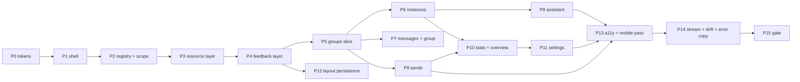

# Group Butler — UI decision record: Option B, the Scope-Spine Registry Shell

| | |
|---|---|
| **Status** | **Accepted** (2026-09-13) — this document is the authoritative UI specification for the dashboard. |
| **Decision** | Option B, as specified in `docs/ui-interface-flexible.md`, is the chosen interface. It is adopted unchanged in shape; this record finalizes it, adds the visual direction, restates every mandatory interaction rule so this file stands alone, and fixes the implementation order. |
| **Context** | `docs/architecture-draft.md` (domain, endpoints, enums, failure modes) · `docs/ui-research-fluent.md` (binding a11y/Fluent-adaptation constraints) · `docs/ui-interface-focused.md` (Option A) · `docs/ui-interface-flexible.md` (Option B). |
| **Consequences** | The dashboard is a multi-workspace application built from three primitives (view, resource, scope), one shell, one resource layer, and one feedback layer. Per-area layout persistence and deep-linkable scope are product features. Workspace count grows by registration, not by new page patterns. |
| **Scope** | Design only. This document writes no product code and grants no permission to alter the BFF handler surface, the Mongo schema, the worker contract, or the send state machine. |

No fabricated product content appears here. Domain nouns, endpoints, enum values, codes, and failure
modes are the architecture draft's; where an example is needed the draft's own illustrative values
are used (`Ops Team`, `12036304…@g.us`) or an explicit placeholder (`⟨instance label⟩`).

---

## 0. Decision record

### 0.1 What was decided

Option B is chosen over Option A ("The Ledger", single canvas + read-only canvas + write-only dock +
one merged chronology). A and B share the same component family (shadcn/ui), the same data sources,
the same scope model, and most of the same state rules; they differ in **information architecture**
and in **where writes live**. B wins because the requirement set is nine distinct working surfaces
(*draft §7.6*) over four genuinely different lookup modes — "which instance is unhealthy", "what
groups does this instance see", "what was said", "what is waiting for approval" — and because
addressability (a URL that names a scope *and* a task) is a feature the operator will use for
runbooks and bookmarks. B pays for this with a registry indirection, which this record bounds
(§2.5).

### 0.2 What is explicitly **not** adopted from Option A

Recorded so no part of A leaks into implementation by familiarity. Each of these is a deliberate
rejection, not an omission.

| Option A element | Status |
|---|---|
| **Write-only dock** — a permanently read-only canvas plus a single write surface | **Rejected.** Writes co-locate with the workspace they belong to (approve in `sends`, compose from `group`/`messages`/`assistant`, config in `instance`, whitelist in `instance`). The R7 guarantee is enforced by the server state machine (`draft §8.1`: no path to `sending` that does not pass `approved`) and *rendered* by `SendStatusTrack` — not by hiding every write affordance behind one panel. |
| **Single rendering route with 308 shims** | **Rejected.** Real routes per workspace (§2.3); aliases resolve by scope normalization, not by redirecting the whole application to one URL. |
| **One merged chronology for messages, media, renames, and send events** | **Rejected.** Separate views with cross-links (message → group, send → group, rename → group). A merged ledger is a legitimate Option A bet; B's search and table affordances depend on typed, sortable rows. |
| **Status ribbon as a primary surface** | **Rejected.** Health is `overview` panels plus per-workspace inline errors plus one shell banner for session/health failures. |
| **A `Resizable` three-region console geometry** | **Rejected.** The layout unit is the panel grid (§2.4); the only resizable affordance is panel span. |
| **"No dashboard" flat stance** | **Partly adopted, as restraint.** A KPI-card wall and a chart gallery are out. `overview` is an **exception queue**: what needs a decision now, with counters rendered as a compact status strip. This is the one refinement this record makes to Option B's `overview`, and it is a restraint on presentation, not a change to the IA. |

### 0.3 Accepted consequences

- **Registry indirection.** Every workspace is expressed as descriptors. Small views pay descriptor
  boilerplate (bounded in §2.5).
- **Navigation depth.** Up to four URL segments. Mitigated by the scope switcher re-scoping the
  current view in place rather than walking the path.
- **Layout persistence store.** One client-side store keyed by `(viewId, breakpoint)`, with reset
  per view and globally. Bounded to order/span/collapse over a fixed per-view panel catalog.
- **Two concepts view authors must keep distinct.** Scope is structural; params are filters
  (§2.3). Enforced by types, not by convention.

---

## 1. Design Read (declared)

> **Genre:** internal operations console for one accountable owner, not a public product surface.
> **Register:** tool-dense and calm — the operator is working, not browsing; no marketing voice, no
> empty-illustration decoration, no KPI theatre.
> **Visual genre:** an admin-workstation composed of shadcn/ui primitives carrying a Fluent-2-derived
> *behaviour and depth* layer: layered surfaces, elevation on interaction, a tight type ramp, focus
> rectangles, and motion used strictly as feedback.
> **Colour regime:** one accent used for selection and primary action; semantic status tones from the
> shadcn theme tokens, always paired with text and an icon. No Fluent colour tokens; no brand
> gradient, no coloured chrome, no coloured headings.
> **Density:** workstation-dense. Tables are the primary instrument; the default row is comfortable
> (40 px), with a compact (32 px) density the operator can select. Whitespace separates regions, not
> rows.
> **Reading order on every screen:** **scope → state → action**. The header states the scope, the
> panels state the current condition, the actions sit with the data they act on.
> **Motion:** ≤ 300 ms, feedback-only (enter, dismiss, elevation wake, live patch). No decorative
> motion, no parallax, no skeleton choreography.
> **The one thing it must never feel like:** a general-purpose SaaS dashboard template where every
> metric is equally important. Nothing is presented before the operator needs it.

---

## 2. The chosen architecture, frozen

### 2.1 Three primitives

Everything in the dashboard is one of three things.

```ts
export type Scope =
  | { kind: "global" }
  | { kind: "instance"; instanceId: string }
  | { kind: "group"; instanceId: string; groupJid: string };

export type ScopeMode = "global" | "instance" | "group";
```

- **View** (`ViewDescriptor`) — a registered destination: `id`, `title`, `icon`, `scopeMode`,
  `routes` (canonical first, aliases after), zod-validated `params`, ordered `panels`, a
  `SkeletonPlan`, `actions`, and one `empty` copy per `EmptyReason`.
- **Resource** (`ResourceDescriptor`) — a declared read: `key(scope, params)`, `fetch`, optional
  `sse` binding, optional `poll` fallback, `skeleton`, `empty`, and `errorMap`. One descriptor ⇒
  one cache entry ⇒ one fetch policy ⇒ one live binding.
- **Scope** — the address of the data, and the *only* way an instance or a group enters a view.

Supporting signatures (unchanged from `docs/ui-interface-flexible.md` §1): `PanelDescriptor`,
`ActionDescriptor`, `useResource`, `useStreamScope`, `useAction`, and the shell/domain component
inventory (`AppShell`, `ScopeSpine`, `WorkspaceHeader`, `PanelGrid`, `Panel`, `ResourceGate`,
`CommandPalette`, `ScopeBanner`, `JidCell`, `GroupNameCell`, `InstanceStateBadge`,
`GroupStateBadge`, `SendStatusTrack`, `MediaSlot`, `RawJsonViewer`, `WhitelistEditor`, `UsageMeter`,
`EmptyState`, `ErrorState`, `AlertDialog` confirmations).

### 2.2 Frozen architectural invariants

1. **One shell.** `AppShell` in `apps/web/src/app/(dash)/layout.tsx` is the only page shell for every
   authenticated page (*draft §7.6*).
2. **One resource layer.** Views never call `fetch`. Every read goes through a `ResourceDescriptor`;
   every failure goes through `errorMap`.
3. **One feedback layer.** `useAction` is the only toast emitter. Views never construct toasts.
4. **Scope is structural.** `groupJid` is never a loose filter param; a view that cannot represent a
   group drops it during normalization instead of half-applying it.
5. **Additivity.** A new workspace is one resource descriptor set, one view descriptor, one
   `registerView()` call. If adding a workspace requires touching `AppShell`, `PanelGrid`,
   `ResourceGate`, or the toast policy, the design has been violated.
6. **Server truth is rendered, never predicted.** Status transitions (`approved`, `sending`, `sent`,
   `failed`) are never optimistic; the last server payload or SSE patch is the only source of a
   status string.
7. **Untrusted content is inert.** React escaping everywhere; no `dangerouslySetInnerHTML` for
   message content; links render as anchor text plus a non-clickable href display (*draft §11.5*).
   `raw.message` appears only inside `RawJsonViewer`, as text (*draft §11.5*).
8. **Media is fetched on demand.** `/api/media/[messageId]/url` mints a short-lived presigned URL
   (*draft §11.4*, default 300 s). A presigned URL is never stored in a cache and never reused past
   expiry.

### 2.3 Routes and scope resolution

| View id | Canonical route(s) | Scope | Primary reads (*draft §7.3*) |
|---|---|---|---|
| `overview` | `/` | global | `/api/health`, `/api/instances`, `/api/sends`, `/api/stats/{bots,tokens}` |
| `instances` | `/instances` | global | `/api/instances` |
| `instance` | `/instances/[instanceId]` | instance | `/api/instances/[id]`, pairing session, `/api/instances/[id]/groups` |
| `groups` | `/groups`, `/instances/[instanceId]/groups` (alias) | global \| instance | `/api/groups`, `/api/instances/[id]/groups` |
| `group` | `/groups/[groupJid]?instance=` | group | `/api/groups/[id]`, `/api/groups/[id]/messages` |
| `messages` | `/messages`, `/instances/[instanceId]/activity` (alias) | global \| instance | `/api/messages` |
| `sends` | `/sends`, `/instances/[instanceId]/sends` (alias) | global \| instance | `/api/sends` |
| `assistant` | `/assistant?instance=` (+ optional `group`) | instance (required), group optional | `/api/assistant` (stream), `/api/assistant/calls` |
| `stats` | `/stats`, `/instances/[instanceId]/stats` (alias) | global \| instance \| group | `/api/stats/{bots,groups,tokens}` |
| `settings` | `/settings` | global | `appSettings`, `auditLog`, `/api/health` |

Rules:

- **Canonicalization.** `parseScope` → `normalizeScope` → `encodeScope`. A request whose scope is
  deeper than the view accepts is normalized (deepest available kept, the rest dropped) and the URL
  is rewritten to canonical; unknown or invalid params are dropped and the view renders a working
  default. A stale bookmark is a normal event, never an error page.
- **Aliases are the same view.** `/groups` and `/instances/[id]/groups` render identically; only the
  scope filter differs. The cross-instance requirement (*draft §7.5*: every instance's group ID and
  current name) is satisfied by the *global* address of `groups`, not by a bespoke screen.
- **`?peek=<panelId>` is URL state**, so a peeked panel is linkable and closes with browser Back.
- **The assistant's instance scope is a route constraint**, mirroring the server's rule that the user
  picks an instance and nothing else about scope comes from the client (*draft §7.2* step 1).

### 2.4 Panels and layout

`PanelGrid` renders 12 columns across four breakpoint tiers. Layout is `{ order, span, collapsed }`
keyed by `(viewId, breakpoint)`, defaulting to the view descriptor.

- Panels come from that view's **fixed catalog**. No widget builder, no user-authored panels.
- Reordering and collapsing only; spans snap to the 12-column scale.
- Layout is **view-local state, never URL state**: a shared link opens the author's reading order.
- Escape hatches: `Reset layout` per view; `Settings → Appearance` resets all.

### 2.5 Bounds on registry indirection

To keep this from becoming a framework for its own sake: no dynamic view loading, no plugin
manifest, no runtime-descriptor serialization, no cross-view descriptor inheritance. A view
descriptor is a TypeScript module export. Aliases are extra strings in `routes`, not extra views.
If a rule in this document cannot be expressed as a field on a descriptor, the rule belongs in
`ResourceGate`, `useAction`, or `AppShell` — and it is implemented **once**, there.

---

## 3. Visual direction and token rationale

### 3.1 Rationale in one paragraph

Fluent 2 is adopted as a **behaviour and depth language**, not as a visual identity: layered
surfaces with elevation on interaction, a labelled and layered type ramp, a strict 4 px spatial
grid, visible focus at a defined weight, keyboard-complete interaction, and motion as feedback.
shadcn/ui is adopted as the **component substrate** and owns the colour system: every status,
selection, and action uses shadcn theme tokens (`--background`, `--foreground`, `--muted`,
`--border`, `--ring`, `--primary`, `--destructive`), which is what keeps the surface consistent with
Tailwind conventions, theme-safe across the light and dark themes this design ships (§3.4), and free
of Microsoft-branded colour. There is **no
`@fluentui/*` dependency**, no Fluent colour token, and no Fluent font file. Depth carries meaning
(elevated = transient or active); colour carries state only when paired with text and an icon.

### 3.2 Concrete tokens

| Group | Value | Used for |
|---|---|---|
| Spatial base | 4 px unit; steps 4 / 8 / 12 / 16 / 24 / 32 / 48 | Panel padding (16), panel gap (16), section gap (24), page gutter (24 → 16 at `md`) |
| Radius | controls 4 · cards/panels 8 · dialogs 12 · sheets 16 top-only | Elevation and radius move together: a lifted surface gets a larger radius |
| Row heights | comfortable 40 · compact 32 · header 36 | Tables (`groups`, `messages`, `stats`, `auditLog`) |
| Shell chrome | header 48 · scope spine 40 · sidebar 240 (expanded) / 48 (icon rail) | Orientation regions |
| Type ramp | Caption 12/16 · Body 14/20 · BodyStrong 14/20/600 · Subtitle 16/22/600 · Title3 20/26/600 · Title2 24/32/600 · Display 28/36/600 | Table body 14; panel titles 16; workspace `h1` 24; `overview` status numbers 28 |
| Type face | system UI stack with a bundled fallback face; identifiers in the monospace ramp with `tabular-nums` | JIDs, `waMessageId`, group IDs, token counts |
| Elevation | 4: `0 2px 4px rgb(0 0 0 / .14), 0 0 2px rgb(0 0 0 / .12)` · 8: `0 4px 8px rgb(0 0 0 / .14), 0 0 2px rgb(0 0 0 / .12)` · 16: `0 8px 16px rgb(0 0 0 / .14), 0 0 2px rgb(0 0 0 / .12)` · 28 (palette, sheet): `0 14px 28px rgb(0 0 0 / .24), 0 0 8px rgb(0 0 0 / .20)` | 16 = panel on hover/focus, dialog; 28 = command palette and sheets only |
| Borders | 1 px `--border` at rest on cards; border removed as elevation appears | Fluent "reveal": cards are stroke-only until hover/focus, then lift |
| Motion | 100 (state) · 150 (enter/exit) · 200 (panel/route) · 300 (sheet, palette) ms. Curves: standard `cubic-bezier(.33,0,.67,1)`, decelerate `cubic-bezier(0,0,0,1)`, accelerate `cubic-bezier(1,0,1,1)` | Feedback only |
| Focus ring | 2 px ring, 1 px offset, two-tone (neutral inner line + `--ring` outer) so it survives any surface | All interactive elements (§4.6) |
| Acrylic | `backdrop-filter: blur(30px) saturate(125%)` on the command palette and sheets only; an opaque fallback is always defined and is used under `prefers-reduced-transparency` | Transient surfaces |
| Selected | Full-row `--accent` wash + medium (600) weight on the row's primary label + an in-flow trailing check glyph in the row's own trailing cell | The current scope target. Three channels (fill, weight, glyph), never a colour alone (§4.6 R-A3) |
| Focused | 2 px `--ring` outline with 1 px offset, drawn on the row's focusable container; never a fill, never a border on the row box | Keyboard position. Orthogonal to selection and visible at the same time (§4.6 R-A4) |
| Hover | Subtle `--muted` wash on the row, no edge treatment | Pointer affordance only |

### 3.3 Visual rules that restrain the Fluent influence

- **No colour ramp.** One accent for selection/primary; status tones are semantic and never
  decorative. Status is always icon + text + tone (§4.6 R-A3).
- **No edge stripes.** A coloured vertical bar on the left of a card, row, or section header is
  decoration and is prohibited at every level of the component tree. State is never drawn as an
  edge: instance and group state, send status, media reason, and selection are encoded by fill
  (where a row is an object), weight, and an icon that lives inside the content flow. No rule in
  this document may be implemented with a `border-left`, a pseudo-element stripe, or an inset
  box-shadow on an edge.
- **Two themes, one meaning system.** Light and dark are both shipped from the same semantic
  tokens (§3.4); no component branch may exist for a theme, and no token may be authored for one
  theme only.
- **No layered wall of cards.** `overview` renders counters as one compact status strip, then the
  exception panels. Cards exist where a card is the object (a send request, an instance, a token
  budget), never as generic containers.
- **Elevation is interaction, not layout.** Panels do not float by default; the page is flat and its
  regions are separated by space and a single hairline.
- **Density is a choice, stored per view.** Comfortable is the default; `Settings → Appearance`
  sets the global default; a per-view toggle is stored with the layout.
- **Charts are tables first.** Where a trend is shown (`stats`), the underlying table is available in
  the same panel, and the chart carries axis labels and a text summary for assistive technology.

### 3.4 Shipped theme strategy

**Decision: ship exactly two themes, light and dark, both authored from the same shadcn semantic
tokens; default to the OS preference via `prefers-color-scheme`, with an explicit owner override of
Light / Dark / System.**

- **How it is built.** One `.dark` class (shadcn's convention) on the document root flips the token
  values. Components consume semantic tokens only (`--background`, `--card`, `--popover`, `--muted`,
  `--accent`, `--border`, `--input`, `--ring`, `--primary`, `--destructive`). No component reads a
  raw colour, and no component branches on the theme. Both themes define the same token names, so a
  component cannot exist in only one of them.
- **How it is chosen.** `prefers-color-scheme` sets the initial value on first paint (no flash: the
  class is applied before hydration from a client-readable store). The override (Light / Dark /
  System) is a client preference persisted in the same local store that already holds layout,
  density, and panel state (§2.4), reachable from `Settings → Appearance` and from the owner menu.
  **No server field is introduced**: `appSettings.ui` is server-owned and carries the timezone in the
  architecture draft, and adding fields to it is outside this document's authority.
- **Why these two, from the operator scene.** The operator works long stretches in dense tables
  reading message text and JIDs, at a desk and on a shared office display, during working hours —
  that is the scene the base theme is authored for, so **light is the reference theme** and is what
  an OS set to light receives. The same person is on call at night and reads the same tables in a
  dark room, where a light page is the one genuinely hostile case; so **dark is a fully supported
  peer**, not a recoloured afterthought, and an OS set to dark receives it automatically with no
  action from the operator.
- **Why not a theme gallery, and why not system-only.** A third theme (high contrast, branded,
  "midnight") would multiply the surface that must be re-verified for contrast (R-A3) and is a
  product-surface decision rather than an operator need — rejected. System-only was also rejected:
  a single operator who spends the night in the app must be able to pin dark without changing the
  whole workstation, and the override is one persisted client value, not a settings subsystem.
- **Consequences that are tested, not assumed.** Contrast floors (R-A3) hold in both themes and are
  verified in both; the accent stays a single accent in both; acrylic surfaces keep opaque fallbacks
  in both and are absent under `prefers-reduced-transparency` (§3.2); media and charts carry no
  hard-coded light background; print or export views, if ever added, are out of scope.
- **Theme is never a data channel.** No state is encoded by "lighter/darker" that is not also
  encoded by token name, text, and icon.

---

## 4. Interaction contract (mandatory)

Normative: **MUST**, **SHOULD**, **MAY** (RFC 2119). Constants live in
`ui/feedback/toast-policy.ts` and `ui/tokens/motion.ts`. Rule identifiers are stable and are cited by
implementation tasks.

### 4.1 Loading and skeletons

**R-L1 — Four loading tiers, chosen by cause, never by guess.**

| Tier | Trigger | Visual | Announcement |
|---|---|---|---|
| `cold` | First load, no cached data for `(scope, params)` | Skeleton blocks from `SkeletonPlan` | One labelled status per region |
| `warm` | Refresh, or scope/param change with previous data present | Existing data at 60 % opacity + 2 px indeterminate bar in the panel header | None (content is readable) |
| `live` | SSE connected, idle | Nothing; a live dot in the workspace header | None |
| `poll` | SSE degraded, 3 s polling active | Identical to `live`; the dot renders hollow with a tooltip | None |

**R-L2 — Skeleton delay and minimum.** A skeleton MUST NOT render for a load settling faster than
`SKELETON_DELAY_MS = 150`; the timer is cleared on settle. Once shown, it MUST remain for at least
`SKELETON_MIN_VISIBLE_MS = 400`.

**R-L3 — Warm beats cold.** With `keepPreviousData` data present, a load MUST use `warm`, never a
skeleton. The indeterminate bar appears only after `WARM_BAR_AFTER_MS = 300`, cycles at 1200 ms, and
is `aria-hidden`.

**R-L4 — Skeleton geometry, no fake content.** Skeletons MUST mirror the final geometry: row-count
band `clamp(lastKnownRowCount ?? 8, 5, 12)`, the real column definitions, `PanelDescriptor.minHeight`
reserved. Skeleton blocks are neutral `--muted` at 0.6 opacity. They MUST NOT contain fake names,
JIDs, message text, timestamps, avatars, badges, or counts, and MUST NOT look clickable.

**R-L5 — Long-running states are not loading states.** Pairing (QR rotation, code, TTL), group sync,
and rollup recomputation MUST render as stateful surfaces with elapsed time, last known step, and a
leave/cancel affordance — never as skeletons. Group sync MUST stream its counts when the endpoint
returns them (*draft §6.6.6* summary).

**R-L6 — Pagination.** Cursor paging MUST keep rendered rows mounted, MUST append a small row-geometry
loader at the history boundary, and MUST NOT replace or reorder existing rows. A filter or scope
change resets the cursor; the URL carries it so Back returns to the same page. Under 400 ms the
append is silent.

**R-L7 — Motion floor.** Under `prefers-reduced-motion: reduce`, shimmer becomes a static block, the
indeterminate bar becomes a static 2 px rule, and enter/exit animation is absent. No layout geometry
changes.

**R-L8 — Controls appear only when actionable.** While a region's data or its permissions are
unknown, its interactive controls MUST NOT be in the DOM (they are not rendered disabled). A control
disabled by *resolved* state MUST carry its reason in a tooltip and in its accessible description
(§4.6 R-A6).

**R-L9 — In-flight actions.** The initiating control enters `pending` immediately: label changes
(`Approve → Approving…`, `Sync now → Syncing…`), `aria-busy="true"`, and it alone is disabled —
the panel, the view, and other rows stay interactive. A control's spinner is rendered only after
150 ms in flight. Concurrent actions on different objects are permitted.

### 4.2 Live updates

**R-V1 — Patch, never interrupt.** An `/api/stream` patch MUST NOT move keyboard focus, MUST NOT
reorder the row being interacted with, and MUST NOT change the selected row's identity. Rows are
keyed by stable ids (`_id`, `groupJid`).

**R-V2 — Data changes are not notifications.** Renames, new messages, media state transitions, and
refresh completions MUST update in place silently. Only the outcome of the operator's own action is
toast-eligible (§4.3 R-T5).

**R-V3 — Degrade invisibly.** The `poll` fallback MUST be indistinguishable in layout and content
from `sse`; only the header indicator changes. No banner, no toast, no skeleton.

**R-V4 — Rename patches are single-source.** One `group.updated` event (*draft §6.6.6*) MUST patch
the group row, the group header, the scope switcher label, and any open message row's group label
in one pass. The `renamed N×` chip opens the capped `subjectHistory` in a sheet.

**R-V5 — Scope switch is atomic.** Changing scope MUST invalidate and re-key every mounted
resource in one commit, so two scopes' data can never be visually interleaved.

### 4.3 Toasts

One `Toaster` mounted in `AppShell` (eagerly, so the live region exists before the first toast).
Emitted only from `useAction`.

**R-T1 — Durations, by outcome class.**

| Class | Duration | Dismiss | Used for |
|---|---|---|---|
| Success | 4000 ms | Auto or manual | A completed operator action with no next step |
| Info | 5000 ms | Auto or manual | A benign, non-obvious consequence (`Group ID copied`) |
| Warning | 8000 ms | Auto or manual | Partly succeeded, or needs later attention |
| Error, recoverable | 8000 ms | Manual | Failed action with an offered recovery |
| Error, blocking | Persistent until dismissed | Manual only | Failed action with no safe recovery control |

**R-T2 — One notification per operation.** An asynchronous action MUST use a single updating toast
(promise pattern) rather than a loading toast followed by a result toast. Auto-dismiss pauses on
hover and on focus-within, and resumes after.

**R-T3 — Stacking, dedupe, position.** Max 3 visible, newest first, excess queued. Dedupe key
`${action}:${targetId}` within `TOAST_DEDUPE_MS = 8000` updates the existing toast with a count
instead of adding one. Position bottom-right; bottom-center below 640 px.

**R-T4 — Accessibility.** The container is a `region` labelled "Notifications". Success/info use
`role="status"` (polite); warning/error use `role="alert"` (assertive), coalesced by the same dedupe.
A toast MUST NOT steal focus, MUST NOT contain focusable content beyond one explicit action button,
and MUST NOT move focus when dismissed. Exactly one polite and one assertive shell region exist.

**R-T5 — Forbidden toasts.** These MUST NOT be toast-only, and where listed as "not at all" they MUST
NOT produce a toast:

| Situation | Correct surface | Why not a toast |
|---|---|---|
| SSE/poll reconnect or stream hiccup | Header live indicator | Background transport |
| A group renamed while the operator reads the table | In-place patch (R-V4) | It is data, not feedback |
| A new message, or media state change | In-place patch | High-rate data |
| A send awaiting approval appearing | `sends` panel count + badge | Persisted state belongs on screen |
| Any **load** failure of a panel | Inline `ErrorState` in that panel | The evidence must outlive 8 seconds |
| Form validation failure | Inline field errors | The field is the evidence |
| `ai_no_whitelist`, token budget reached | Inline state in `assistant` | The corrective action is right there |
| `ambiguous` send failure | `SendStatusTrack` inline alert | A disappearing toast cannot carry a double-post warning |
| Connection loss, `logged_out`, Mongo/worker unreachable | Shell or workspace banner / inline alert | Durable operational failure |
| Anything implying a WhatsApp send occurred | Server state only (`approved`/`sending`/`sent`) | An optimistic toast could be untrue |

A toast MAY accompany an inline failure for immediacy, but MUST NEVER replace it.

### 4.4 Empty states

**R-E1 — One copy per reason.** Every resource MUST declare all five; the type makes omission a
compile error.

| `EmptyReason` | Shown when | Primary affordance |
|---|---|---|
| `no-data` | Scope valid, genuinely empty (`⟨instance label⟩` has no groups synced yet) | The action that creates data: `Sync now`, `Create instance` |
| `filtered` | Data exists; current params match nothing | `Clear filters` (scope preserved) |
| `unconfigured` | A prerequisite is missing: no whitelist ⇒ AI disabled (*draft §7.2* step 2); no assigned group ⇒ no send target | Go to the prerequisite editor |
| `unavailable` | A prerequisite service is down (`/api/health`: Mongo or worker unreachable) | `Retry` + link to `settings` |
| `not-permitted` | The request cannot be made in this scope (group scope missing its instance) | `Return to groups` |

**R-E2 — Emptiness is distinguishable.** `no-data` and `filtered` MUST NOT share copy; the first
offers creation, the second clearing. A generic "No data" is forbidden.

**R-E3 — Empty is never an error; error is never an empty.** A failed read renders `ErrorState`, not
an empty state.

**R-E4 — Unreadable media is a fact, not an empty slot.** `media.status ∈ {unparsed, unavailable,
failed}` MUST render the declared type plus the reason (`view_once`, `expired`, `no_keys`,
`download_failed`, `unsupported_type`, `too_large`), each with its own one-line explanation
(*draft §5.1*).

**R-E5 — Accessibility of empty states.** The empty state's action is the first focusable element in
its region; the region heading is `h2` under the workspace `h1`; a disabled action names its
prerequisite in body text instead of being silently disabled.

### 4.5 Errors

**R-X1 — One shape.** Every failure becomes a `UIError`:

```ts
interface UIError {
  code: string;              // server `code` when present, else a client code ("network", "timeout")
  title: string;             // one short sentence, no jargon
  body?: string;             // one sentence of cause or consequence
  action?: { label: string; kind: "retry" | "dismiss" | "navigate"; href?: string };
  surface: "inline" | "banner" | "toast";
  retryable: boolean;
}
```

Unknown codes fall back to a generic title and MUST display the raw `code` in a copyable monospace
chip. Stacks, driver messages, and raw worker JSON MUST NOT be rendered (*draft §6.7*, *§11.5*).
Every error MUST state what still works (e.g. ingest continues while a read fails).

**R-X2 — Surface selection.** A resource failure is inline in its own panel and MUST NOT blank the
workspace; sibling panels keep rendering and retain prior data. Session failure or `/api/health`
failure is a shell banner. An owner-initiated action failure is a toast (or inline in the dialog that
owns it — a dialog MUST NOT dismiss on failure).

**R-X3 — Known signals.**

| Code / signal | Surface and rule |
|---|---|
| `ai_no_whitelist` (409, *draft §7.2*) | `assistant` input disabled before submit; inline `unconfigured` state with a link to the whitelist editor; the typed question is preserved |
| `not_whitelisted` inside a call (*draft §7.2* step 3) | One line under the answer: `⟨N⟩ retrieval requests were outside this scope and were refused`, linking to the `aiCalls` row |
| `foreign_media` (*draft §6.5*) | Send composer error, inline: only media already stored by the worker can be attached |
| `dispatch.errorClass:"ambiguous"` (*draft §8.1, §8.3*) | `SendStatusTrack` shows "Delivery unknown — re-approve to retry"; the only action is re-approve; `Retry` MUST NOT be rendered |
| `dispatch.errorClass:"auth"` | Instance banner: re-pair required; the per-send error is suppressed (one cause, one surface) |
| `dispatch.errorClass:"transport"` / `"rejected"` | Retryable copy on the send card, with re-approval where the state machine requires it |
| `runtime.status:"logged_out"` (*draft §15*) | Persistent instance banner + badge; group and message data stays readable because those reads come from Mongo (*draft §7.5*) |
| Mongo unreachable (*draft §15*) | Panel `ErrorState` + shell banner: ingest continues, this view cannot load |
| Worker unreachable (*draft §15*) | Shell banner + `sends` shows *queued*, not failed: approved sends wait for the ticker |
| R2 unavailable (*draft §15*) | `MediaSlot` chip with `media.status` + `reason`; the rest of the row is unaffected; one retry, then none |
| Login rate limit (*draft §11.1*) | Inline on the form plus one toast; never reveals whether the email exists |
| Network offline | Write controls disabled with the reason; readability unaffected. **Approval is never queued client-side** |

**R-X4 — Recovery is a control.** Any error with `retryable: true` MUST render an action that re-runs
exactly the failed call. A retry is offered only when the operation is idempotent; for a state
transition, "Retry" re-opens the confirmation rather than re-issuing the transition. An error with no
recovery path MUST state the resulting system state (e.g. "the message will not be retried
automatically").

### 4.6 Accessibility (non-negotiable)

**R-A1 — Focus on navigation.** After a route or scope change, focus moves to the workspace `h1`
(`tabIndex={-1}`) and the change is announced as the view title. A peek sheet receives focus on open
and returns focus to its trigger on close. When the focused row is removed, focus moves to the next
row, or to the panel heading when the list empties — never to `body`.

**R-A2 — Busy regions.** A loading region carries `aria-busy="true"`; skeleton nodes are
`aria-hidden="true"`; one visually hidden `role="status"` per region carries a concise label
(`Loading groups for ⟨scope⟩`). No per-row live regions. Completion is announced only if the load
exceeded 1000 ms.

**R-A3 — Colour is never the message.** Instance/group state, send status, media reason, and token
budget MUST pair tone with text and an icon. Status text meets 4.5:1 against its actual surface
(including translucent chrome, which is why it keeps a solid fallback); borders used as meaning meet
3:1. No dot-only indicators.

**R-A4 — Focus is always visible; selection is never a stripe.** Focus uses one treatment
everywhere: a 2 px ring, 1 px offset, ≥ 3:1 against the adjacent surface, two-tone on dark and
acrylic surfaces; it MUST NOT be removed or replaced by a colour change. Selection uses a
surface-level accent wash plus medium weight on the object's primary label plus an in-flow
indicator glyph inside the object's own grid — three channels, none of them an edge. Selection MUST
NOT be implemented as a left or right edge border, a pseudo-element stripe, or an edge inset shadow
anywhere in the tree, and no other state may use an edge treatment either. Focus and selection MUST
be simultaneously perceptible when the focused object is also the selected one: focus is a line,
selection is a fill, a weight, and a glyph. Both MUST remain distinguishable with colour removed and
in both shipped themes.

**R-A5 — Landmarks and headings.** `nav` (registry navigation), `main` (current workspace), `header`
(scope + identity + palette trigger + owner menu), `contentinfo` (build/health). Exactly one `h1`
(the workspace heading); panel titles are `h2` inside their region; no skipped levels.

**R-A6 — Keyboard.** `⌘K`/`Ctrl+K` opens the command palette; `/` focuses the workspace search field;
`Esc` closes the topmost layer only; `mod+Enter` submits the focused composer or approval dialog;
`?` opens the shortcut reference. Every pointer action has a keyboard path — including copy-JID,
open group, approve, and re-approve. Shortcuts never fire from inside text inputs and never override
browser or assistive-technology shortcuts. Disabled controls expose their reason.

**R-A7 — Announcements.** Exactly one polite and one assertive shell region. View changes, action
outcomes, and post-action counts are announced. Background row patches are not. Streaming answer text
uses a throttled polite region (≤ 1 announcement per 2 s) and `Stop` remains operable throughout.

**R-A8 — Destructive actions.** The shadcn `AlertDialog` pattern: name the target and the
consequence; return focus to the invoking control on close. Toasts are never the only home for a
destructive or connection/send/rename failure (R-T5).

**R-A9 — Motion and transparency preferences.** `prefers-reduced-motion: reduce` removes enter/exit
animation and shimmer (R-L7). `prefers-reduced-transparency: reduce` replaces acrylic with opaque
surfaces at the same elevation.

### 4.7 Mobile and small-viewport rules

The dashboard is device-agnostic by contract; the operator must be able to triage from a phone.

**R-M1 — Reflow, never overflow.** Every workspace MUST reflow without horizontal scrolling of
tables, message streams, or composers down to 320 px, and at 400 % zoom. Dense tables degrade to
stacked row cards (label/value pairs from the same column definitions); they MUST NOT scroll
sideways.

**R-M2 — Chrome collapse.** Below `md`: the registry navigation becomes a `Sheet` opened from the
header; the scope spine becomes a compact scope chip that opens a `Sheet` containing the switcher;
the command palette stays available as a header control. The workspace identity and the scope
MUST remain visible without opening anything.

**R-M3 — Panels stack.** `PanelGrid` becomes one column; span values are ignored in document order.
A panel the operator could resize on desktop MUST NOT be collapsed to zero height on mobile.

**R-M4 — Touch targets.** Interactive targets meet the WCAG 2.2 minimum of 24 × 24 CSS px, with
larger targets for frequent controls (approve, send, sync, copy-JID, re-approve). Adjacent icon
controls keep sufficient separation.

**R-M5 — Composer ergonomics.** An open composer MUST remain reachable above the on-screen keyboard
and MUST NOT be covered by a toast — toasts move to the top edge while a composer or sheet is open.

**R-M6 — Peek sheets replace hover.** Any affordance that is hover-only on desktop MUST have an
explicit tap target on touch. A peek opened from a row is a full-height sheet with its own heading
and a visible close control.

**R-M7 — Long identifiers.** Long group names truncate with a full accessible label (never silent
clipping); JIDs wrap or scroll inside their own monospace container and remain copyable.

**R-M8 — Live updates on mobile.** R-V1 and R-V4 hold unchanged: no auto-scroll to new content, no
focus theft, and a `⟨N⟩ new` control at the stream edge when the operator has scrolled away.

---

## 5. Implementation order

Ordered, dependency-honest. Each phase lands with its own scoped proof; a phase MUST NOT begin before
its dependencies are green. Phases are vertical where the design allows, so the app is usable early.



- [ ] **P0 — Token layer.** `ui/tokens/{fluent.css,type-ramp.ts,shadow.ts,motion.ts}`: spatial steps,
  radii, row heights, type ramp, elevation, border/reveal, motion curves and durations, focus
  treatment, acrylic + opaque fallback, and **both shipped theme token sets** (light reference, dark
  peer) with the `.dark` class contract of §3.4. shadcn theme tokens confirmed as the only colour
  source (§3.1). *Proof:* a token table diffed against §3.2 in both themes; every value consumed by
  name — no raw hex or px in components, and no token defined for only one theme.
- [ ] **P1 — Shell and auth.** `(dash)/layout.tsx` with `AppShell`, session gate, registry
  navigation (expanded + icon rail), header, `CommandPalette` mounted (palette may be minimal),
  `Toaster` mounted eagerly, reduced-motion/transparency handling. *Proof:* every authenticated route
  renders inside the one shell; logout returns to `/login`; the shell contains exactly one polite and
  one assertive live region.
- [ ] **P2 — Registry and scope.** `ViewDescriptor`/`PanelDescriptor` types, `registerView`,
  `resolveView`, `parseScope`/`normalizeScope`/`encodeScope`, zod param codecs, alias resolution,
  `ScopeSpine`. *Proof:* table-driven cases — canonicalization, invalid params, aliases, group scope
  without instance, unknown view, stale bookmark; each renders a working default.
- [ ] **P3 — Resource layer.** `useResource` with `cold/warm/live/poll/idle/error`, cache keyed by
  `(scope, params)`, `keepPreviousData`, `ResourceGate`, single `EventSource` with `SSEBinding`
  fan-out, poll fallback, `invalidateOn`, `errorMap` seam. *Proof:* tier transitions per R-L1–R-L3
  (including the 150 ms delay and 400 ms minimum), a scope switch that never interleaves two scopes'
  data (R-V5), and a simulated SSE→poll fallback with identical DOM.
- [ ] **P4 — Feedback layer.** `useAction`, toast policy (durations, dedupe, stacking, roles, promise
  pattern), `EmptyState` with all five reasons, `ErrorState` with `UIError` mapping, `AlertDialog`
  confirmations, error-copy map. *Proof:* R-T1–R-T5 exercised as a table; every forbidden toast
  produces no toast; every unknown code falls back and shows a copyable code.
- [ ] **P5 — First vertical slice: `groups` at both scopes.** Group table with **Group ID + current
  name** (*draft §7.5*, *§6.6*), `nameSource:"fallback"` label, `subjectHistory` chip, state badges,
  rename provenance, `Sync now` with streamed counts, `assign`/`whitelist` toggles, cross-instance
  global view, SSE `group.updated` patch of row + header + scope label (R-V4). *Proof:* R11 acceptance
  — the full `<id>@g.us` is visible and copyable and the current name is non-empty for every row; a
  rename event patches in place without a toast and without moving focus; fallback names render and
  then resolve after sync.
- [ ] **P6 — `instances` and `instance`.** List, create, pairing as a stateful surface (R-L5), config
  editor, whitelist editor writing `instances.config.groupJidWhitelist` and mirroring
  `groups.config.whitelisted`, status badges, per-instance group table, `Sync now`, logout. *Proof:*
  `disconnected → pairing → connected` traverses without a skeleton; empty whitelist produces the
  `unconfigured` state everywhere it is consumed; `logged_out` raises the re-pair banner while data
  stays readable.
- [ ] **P7 — `messages` and `group`.** Global search (`q` → text index + filters), cursor paging
  (R-L6), group header, message stream, `MediaSlot` with on-demand presign and the unreadable-media
  reason set (R-E4), `RawJsonViewer`, group stats panel, compose entry point. *Proof:* search + filters
  + Back restores the same page; media bytes are requested only on demand and re-requested on expiry;
  no message content reaches the DOM as HTML.
- [ ] **P8 — `assistant`.** Required instance scope, permanent `ScopeBanner` disclosing the whitelist
  snapshot, streaming answer with throttled announcements and `Stop`, citations, `aiCalls` history,
  `ai_no_whitelist` / budget states inline, whitelist-rejection line (R-X3). *Proof:* an empty
  whitelist disables input before submit; the banner cannot widen scope; a rejection inside a call
  surfaces the count and links to the call row.
- [ ] **P9 — `sends`.** Composer (text, worker-stored media only, reply context), draft →
  `pending_approval` → approve (`note`, `scheduledFor` > now + 30 s) → reject → cancel,
  `SendStatusTrack` rendering the state machine including `dispatch.attempts`, the `ambiguous`
  no-retry rule, dispatch history, `origin:"ai_suggestion"` drafts from the assistant. *Proof:*
  ambiguous failure renders re-approve only; approval is never optimistic; every transition writes the
  audit-backed state the server returns.
- [ ] **P10 — `stats` and `overview`.** Three tabs (bots / groups / tokens) with tables and trend
  charts that expose their underlying rows, rollup recompute with streamed progress, whitelist
  rejections as a security metric; `overview` as the exception queue with the compact counter strip
  (§0.2). *Proof:* counters and rollups are distinguishable in the UI; every overview panel resolves
  to a real state (`no-data`, `unavailable`, `filtered`) with no invented numbers.
- [ ] **P11 — `settings`.** AI budget (global + per-instance override), retention, storage/R2 info,
  `/api/health` detail, audit log with cursor paging, appearance (density, reset all layouts).
  *Proof:* audit rows match the actions performed; health shows Mongo and worker reachability
  separately.
- [ ] **P12 — Client preference store.** Per-`(viewId, breakpoint)` order/span/collapse, defaults from
  descriptors, per-view reset and global reset, compact/comfortable density, and the theme override
  (Light / Dark / System) of §3.4 — all one store, applied before hydration so there is no theme
  flash. *Proof:* a rearranged view and a pinned theme both survive reload; a shared link opens the
  descriptor's default order; reset restores defaults exactly; an unknown stored value falls back to
  `System`.
- [ ] **P13 — Accessibility, theme and mobile pass.** R-A1–R-A9 and R-M1–R-M8 applied across all ten
  views in **both themes**: landmarks/headings, focus restoration, focus-vs-selection orthogonality
  (R-A4), target sizes, reflow at 320 px and 400 % zoom, sheet-based chrome below `md`, composer
  ergonomics, announcements, reduced motion/transparency. *Proof:* keyboard-only walkthrough of the
  full journey (login → create → pair → sync → assign → whitelist → search → ask → approve) run once
  in light and once in dark; focus and selection distinguishable with colour removed; a 320 px /
  400 % zoom pass on every view with no horizontal scrolling; no element anywhere renders an edge
  stripe.
- [ ] **P14 — Live transport and drift guards.** Resume-token reconnect, backoff, SSE↔poll parity
  test, worker contract parity through the shared zod schemas (*draft §6.7*), complete `error-copy`
  map coverage for every code the worker can emit (*draft §6.5*), stale-scope deep-link handling.
  *Proof:* forced SSE failure produces no visible change beyond the indicator; an unknown worker code
  renders the fallback with a copyable code; a drift fixture fails loudly.
- [ ] **P15 — Decision gate.** Walk §6 in order; nothing ships with an unchecked line.

---

## 6. Definition of done (gate)

- [ ] All ten views render inside the single `AppShell`; no view calls `fetch` directly.
- [ ] Every read is a `ResourceDescriptor`; every declared empty reason has copy that differs from its
  siblings (R-E2).
- [ ] Loading shows the correct tier for its cause; skeletons pass R-L2, R-L4, and R-L7 and contain no
  fake content.
- [ ] No toast can be produced by a background event, a load failure, or a status transition (R-T5).
- [ ] A failed panel never blanks its workspace; a failed action never dismisses its dialog (R-X2).
- [ ] The `ambiguous` send path offers re-approve only; the `auth` path shows the re-pair banner
  (R-X3).
- [ ] Scope, not a filter param, is the only way a group enters a view; canonicalization handles stale
  and partial URLs without an error page (R-V5, §2.3).
- [ ] Keyboard-only completion of the full journey; focus restoration per R-A1; exactly one polite and
  one assertive shell live region.
- [ ] 320 px and 400 % zoom reflow with zero horizontal scrolling on every view; targets ≥ 24 × 24 px
  (R-M1, R-M4).
- [ ] Status is never conveyed by colour alone anywhere (R-A3), and no element encodes state with a
  coloured edge stripe, `border-left`, pseudo-element stripe, or edge inset shadow (R-A4, §3.3).
- [ ] Focus and selection are simultaneously perceptible on the same object, and both remain
  distinguishable with colour removed (R-A4).
- [ ] Both shipped themes (light, dark) pass the contrast floors of R-A3; no component branches on the
  theme and no token exists in only one theme (§3.4).
- [ ] No `dangerouslySetInnerHTML` for message content; `raw.message` is text-only (§2.2 invariant 7).
- [ ] Media is fetched only through short-lived presigned URLs, never cached (§2.2 invariant 8).
- [ ] Adding a hypothetical eleventh workspace touches only its descriptor files (§2.2 invariant 5).

---

## Appendix — Traceability

| Architecture requirement | Where the decision satisfies it |
|---|---|
| R4 searchable raw messages | `messages` view: `q` → Mongo text index (*draft §6.4*) + filters, cursor paging (R-L6) |
| R5 AI restricted by per-instance whitelist | `assistant` requires instance scope; permanent `ScopeBanner`; `ai_no_whitelist` handled before submit (R-X3) |
| R6 multi-instance, instance → many groups | `ScopeSpine`; instance-scoped aliases of shared views (§2.3) |
| R7 human-approved / scheduled sends | `sends` view; `SendStatusTrack`; ambiguous-send rule; approval never optimistic (R-T5, R-X3) |
| R8 bot / group / token statistics | `stats` tabs; `UsageMeter` counter strip on `overview` (§2.3, §0.2) |
| R11 group ID + current name | `groups` at both scopes; fallback label; rename provenance; single-event rename patch (P5, R-V4) |
| Single page shell (*draft §7.6*) | `AppShell` in `(dash)/layout.tsx` (§2.2 invariant 1) |
| SSE with polling fallback, identical interface (*draft §7.4*) | R-L1 `poll` tier, R-V3 |
| No `dangerouslySetInnerHTML`; raw JSON as text (*draft §11.5*) | `RawJsonViewer`; §2.2 invariant 7 |
| Presigned media only (*draft §11.4*) | `MediaSlot` on-demand presign; §2.2 invariant 8 |
| Failure modes (*draft §15*) | R-X3 rows for Mongo, R2, worker down, logged-out session, restart-mid-send, replica-set loss |
