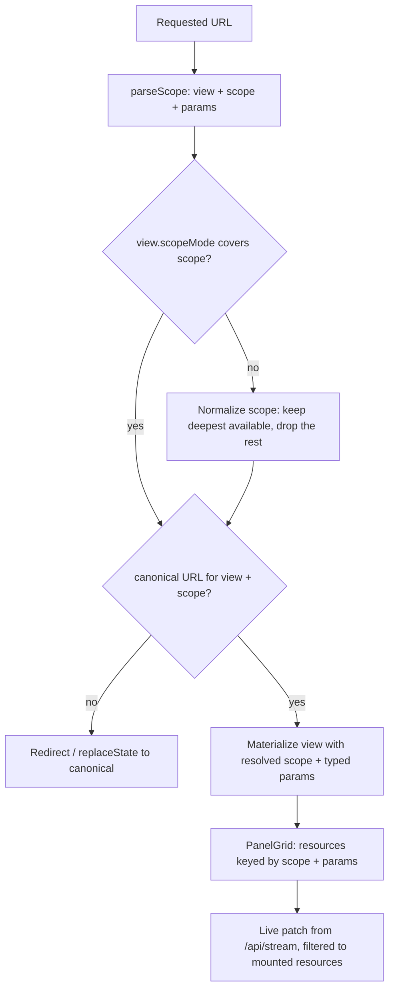

# Group Butler — UI Option B: the Scope-Spine Registry Shell

Status: **design proposal**. Companion to `docs/architecture-draft.md` (cited below as *draft §n*).
No product code exists yet; this document designs the dashboard surface only and changes no code.

This is the **flexible** option: a multi-workspace information architecture in which every screen is
a *registered view over a shared scope and resource layer*, so all nine dashboard areas
(*draft §7.6*) are built from the same three primitives. The alternative on the table (the
single-canvas operator console, `docs/ui-interface-focused.md`) fixes one pane and collapses
navigation into a command palette. This option keeps deep links, bookmarks, and per-area layouts as
first-class citizens, and pays for that with a registry indirection.

Visual language: **shadcn/ui primitives and patterns** (sidebar, data table, tabs, sheet, dialog,
command, skeleton, sonner) carrying a **Fluent-2-derived token layer** — depth instead of borders,
a restrained type ramp, focus rectangles, reveal-on-hover, acrylic only for transient surfaces
(Appendix A).

Constraints inherited from the draft that this design MUST NOT violate:

| Constraint | Source |
|---|---|
| shadcn/ui primitives only; no hand-rolled buttons/inputs/cards/empty states | draft §7.6 |
| One page-shell component for every authenticated page | draft §7.6 |
| Tailwind design tokens only (no ad-hoc hex/px in components) | draft §7.6 |
| React escaping everywhere; `dangerouslySetInnerHTML` banned for message content; links render as anchor text + non-clickable href | draft §11.5 |
| `raw.message` only in a collapsible JSON viewer, never interpreted | draft §11.5 |
| Media only through short-lived presigned URLs (`R2_PRESIGN_TTL_SECONDS`, default 300) | draft §11.4 |
| SSE (`/api/stream`) with a silent 3-second polling fallback; **the interface is identical either way** | draft §7.4 |
| Identity is one owner; no roles, no per-user preferences, no multi-tenancy UI | draft §2.1, §11.1 |
| `organizationId` is server-derived on every request; the client never supplies it | draft §7.3, §11.1 |

---

## 1. Interface, component signatures, and route/module structure

### 1.1 The three primitives

Everything in the dashboard is one of three things, and nothing else:

1. **A view** — a registered destination: route, accepted scope, parameters, default panel layout,
   skeleton plan, actions, empty copy.
2. **A resource** — a declared read: cache key, fetcher, live-patch binding, polling fallback,
   skeleton/empty/error behaviour.
3. **A scope** — the address of the data being looked at: global, one instance, or one group inside
   one instance.

```ts
// apps/web/src/ui/registry/types.ts

/** The address of everything the dashboard can show. */
export type Scope =
  | { kind: "global" }
  | { kind: "instance"; instanceId: string }
  | { kind: "group"; instanceId: string; groupJid: string };

/** Which scopes a view accepts. Determines the canonical route it materializes at. */
export type ScopeMode = "global" | "instance" | "group";

/** Ordered, typed navigation state. Every field is URL-addressable or has a defined default. */
export interface ViewDescriptor<P extends z.ZodTypeAny = z.ZodTypeAny> {
  id: string;                       // stable key: "groups", "sends", "assistant"
  title: string;                    // workspace heading + document title segment
  icon: LucideIcon;                 // nav + command palette
  scopeMode: ScopeMode;             // the deepest scope this view accepts
  routes: readonly string[];        // canonical first; aliases resolve to canonical (§1.3)
  params: P;                        // search params: filters, cursor, sort, density, peek
  panels: readonly PanelDescriptor[];   // the default layout, in reading order
  skeleton: SkeletonPlan;           // first-paint geometry (never derived at runtime)
  actions: readonly ActionDescriptor[]; // header buttons AND command-palette entries
  empty: EmptyPlan;                 // one copy per EmptyReason
  instructions?: string;            // one-line "what this workspace is for", shown in the help sheet
}

/** A projection of one or more resources into the layout grid. */
export interface PanelDescriptor {
  id: string;                       // unique within the view
  title: string;
  grid: { base: 1 | 12; md: 4 | 6 | 8 | 12; xl: 3 | 4 | 6 | 8 | 9 | 12 };  // 12-col, 4 tiers
  minHeight: number;                // reserved px so load never shifts layout (§5.1 R-L4)
  depth: "summary" | "detail" | "raw";
  resources: readonly ResourceRef[];
  peekable: boolean;                // openable as a Sheet from a sibling view (never a new tab)
  render: (props: PanelProps) => ReactNode;
}

/** A declared read. One descriptor ⇒ one cache entry ⇒ one fetch policy ⇒ one live binding. */
export interface ResourceDescriptor<D, P = unknown> {
  id: string;                       // "instance.groups", "messages.search", "sends.queue"
  key: (scope: Scope, params: P) => string;  // includes organizationId-derived segment
  fetch: (ctx: ResourceCtx<P>) => Promise<D>;
  sse?: SSEBinding;                 // which /api/stream events patch which fields
  poll?: { intervalMs: number };    // used only when the SSE transport reports degraded
  invalidateOn?: readonly string[]; // resource ids whose mutations invalidate this one
  skeleton: (ctx: ResourceCtx<P>) => ReactNode;
  empty: Record<EmptyReason, EmptyCopy>;
  errorMap: (err: unknown) => UIError;   // never surfaces a raw error object (§5.5 R-X3)
}

/** A named, permission-free operation the owner can run. One definition, three surfaces. */
export interface ActionDescriptor {
  id: string;                       // "groups.sync"
  label: string;
  icon: LucideIcon;
  shortcut?: string;                // "g s", "mod+enter" — relative to the active workspace
  resource?: ResourceRef;           // what it invalidates on success
  confirm?: ConfirmPlan;            // destructive only (§5.6 R-A9)
  run: (ctx: ActionCtx) => Promise<ActionResult>;
}
```

### 1.2 Hooks and components

```ts
// apps/web/src/ui/data/resource.ts
export function useResource<D, P>(
  ref: ResourceRef<D, P>,
  options?: { keepPreviousData?: boolean; enabled?: boolean },
): {
  data: D | undefined;
  error: UIError | undefined;
  state: "idle" | "cold" | "warm" | "live" | "error" | "blocked";
  isStale: boolean;
  transport: "sse" | "poll";
  refresh(): void;
};

// apps/web/src/ui/data/stream.ts — one EventSource for the whole app, fanned out by binding.
export function useStreamScope(scope: Scope, bindings: readonly SSEBinding[]): void;

// apps/web/src/ui/feedback/use-action.ts — the only place toasts are emitted.
export function useAction<A extends ActionDescriptor>(action: A): {
  run(ctx: Omit<ActionCtx, "action">): Promise<ActionResult>;
  pending: boolean;
  disabledReason?: string;          // rendered as a Tooltip, never as a silent no-op
};
```

```tsx
// apps/web/src/ui/shell/* — the single page shell required by draft §7.6.
<AppShell scope={Scope} view={ViewDescriptor} nav={NavModel} />   // authenticate → scope resolve → view render
<ScopeSpine value={Scope} onChange={(s: Scope) => void} />        // instance/group switcher; URL is the source of truth
<WorkspaceHeader view={ViewDescriptor} scope={Scope} />           // h1, breadcrumb, actions, live indicator
<PanelGrid layout={LayoutState} viewId={string} />                // persisted per (viewId, breakpoint)
<Panel descriptor={PanelDescriptor} scope={Scope}>…</Panel>
<ResourceGate resource={ResourceRef}>                             // owns skeleton / empty / error / live rules
  {({ data, state }) => ReactNode}
</ResourceGate>
<CommandPalette registry={ViewRegistry} scope={Scope} />          // ⌘K: views, actions, groups, instances
<ScopeBanner scope={Scope} whitelist={WhitelistSnapshot} />       // always-on AI scope disclosure (§6)
```

Domain cells, built once and reused by every workspace (this is what "supports all workspaces
cleanly" buys — a group is rendered identically in a table row, a peek sheet, and a header):

```tsx
<JidCell jid={string} copyable />                 // monospace, full `<id>@g.us`, copy button named by value
<GroupNameCell name={string} nameSource={"sync"|"event"|"fallback"} renameCount={number} />
<InstanceStateBadge status={"disconnected"|"pairing"|"connected"|"logged_out"|"error"} />
<GroupStateBadge state={"active"|"left"|"deleted"|"suspended"} />
<SendStatusTrack status={SendStatus} approval={Approval} dispatch={DispatchView} />  // draft §8.1 machine
<MediaSlot media={MediaView} onRequestUrl={(messageId) => Promise<string>} />       // presign on demand
<RawJsonViewer value={unknown} />                                                   // text only, draft §11.5
<WhitelistEditor instanceId={string} groups={GroupOption[]} />                      // draft §7.2
<UsageMeter usage={TokenUsage} ceiling={number} />                                   // tokens vs AI_MAX_TOKENS_PER_DAY
<EmptyState reason={EmptyReason} copy={EmptyCopy} />
<ErrorState error={UIError} retry={() => void} />
```

### 1.3 Scope resolution — one view, three addresses

A view declares the deepest scope it can use. The shell computes the canonical URL from
(view, scope) and never lets the two drift; aliases (a global route with `?scope=instance&id=…`)
resolve to the canonical address so every link an operator copies is shareable.



Rules:

- **`/groups` and `/instances/[instanceId]/groups` are the same view.** The instance-scoped address
  is canonical when a scope is selected; the global address is canonical when it is not. The panel
  set, skeleton, empty copy, and actions are identical — only the scope filter differs. A
  cross-instance requirement (*draft §7.5*, "every group's ID and current name") is therefore met by
  the *global* address of the same view, not by a bespoke screen.
- **Scope is the only way a group enters a view.** `groupJid` never travels as a loose filter
  parameter; it is part of `Scope`, so a view that cannot represent a group (e.g. `/settings`) drops
  it at normalize time rather than rendering a half-applied filter.
- **Params are zod-validated.** Invalid or unknown params are dropped and the canonical URL is
  rewritten; the view MUST render a working default rather than an error, because a stale bookmark
  is a normal event.
- **`?peek=<panelId>` is a URL state**, so the sheet that shows "this message in context" is
  linkable and closable with the browser Back button.

### 1.4 Route and module structure

Routes in `apps/web/src/app/(dash)/` are thin: they resolve scope from the segment, then hand off to
the registry. All behaviour lives under `apps/web/src/ui/`.

```
apps/web/src/
├─ app/
│  ├─ login/page.tsx                     # unauthenticated; form + rate-limit feedback (§5.5 R-X1)
│  └─ (dash)/
│     ├─ layout.tsx                      # <AppShell> + registry wiring; the ONE shell (draft §7.6)
│     ├─ page.tsx                        # view:overview          scope: global
│     ├─ instances/page.tsx              # view:instances         scope: global
│     ├─ instances/[instanceId]/
│     │  ├─ page.tsx                     # view:instance          scope: instance  (tab default)
│     │  ├─ groups/page.tsx              # view:groups   (alias → canonical for instance scope)
│     │  ├─ activity/page.tsx            # view:messages (alias, pre-scoped)
│     │  ├─ sends/page.tsx               # view:sends    (alias, pre-scoped)
│     │  └─ stats/page.tsx               # view:stats    (alias, pre-scoped)
│     ├─ groups/page.tsx                 # view:groups            scope: global
│     ├─ groups/[groupJid]/page.tsx      # view:group             scope: group (needs ?instance=)
│     ├─ messages/page.tsx               # view:messages          scope: global
│     ├─ sends/page.tsx                  # view:sends             scope: global
│     ├─ assistant/page.tsx              # view:assistant         scope: instance (+ optional group)
│     ├─ stats/page.tsx                  # view:stats             scope: global|instance|group
│     └─ settings/page.tsx               # view:settings          scope: global
└─ ui/
   ├─ registry/
   │  ├─ types.ts                        # §1.1 signatures (the contract everything else obeys)
   │  ├─ registry.ts                     # registerView / resolveView / listCommands
   │  ├─ scope.ts                        # parseScope / encodeScope / normalizeScope
   │  └─ views/{overview,instances,instance,groups,group,messages,sends,assistant,stats,settings}.tsx
   ├─ shell/{AppShell,ScopeSpine,WorkspaceHeader,PanelGrid,Panel,CommandPalette,HelpSheet}.tsx
   ├─ data/{resource.ts,stream.ts,poll.ts,cache.ts,optimistic.ts}
   ├─ feedback/{use-action.ts,toast-policy.ts,EmptyState.tsx,ErrorState.tsx,ResourceGate.tsx}
   ├─ cells/{JidCell,GroupNameCell,InstanceStateBadge,GroupStateBadge,SendStatusTrack,MediaSlot,
   │          RawJsonViewer,WhitelistEditor,UsageMeter}.tsx
   └─ tokens/{fluent.css,type-ramp.ts,shadow.ts,motion.ts}   # the Fluent layer over Tailwind tokens
```

**Adding a workspace is three files and zero shell changes**: one `ResourceDescriptor` set
(`ui/data/`), one `ViewDescriptor` with its panels, one `registerView()` call. `PanelGrid`,
`CommandPalette`, nav, skeletons, empty states, and toasts are inherited. That is the whole point of
this option: the dashboard has a *catalog*, not a set of pages that each re-implement loading.

### 1.5 The workspace catalog

Nine views cover `draft §7.6` with no special cases. "Alias" means the view is pre-scoped and
resolves to its canonical address.

| View id | Canonical route(s) | Scope | Primary reads (draft §7.3) | Primary actions |
|---|---|---|---|---|
| `overview` | `/` | global | `/api/health`, `/api/instances`, `/api/sends` (queue), `/api/stats/{tokens,bots}` | Jump to a failing instance; approve a waiting send |
| `instances` | `/instances` | global | `/api/instances` | `POST /api/instances` (create + pair) |
| `instance` | `/instances/[id]` | instance | `/api/instances/[id]`, `pairingSessions` (via BFF) | `PATCH /api/instances/[id]` (config incl. whitelist), `POST …/pairing-code`, `…/logout`, `…/groups/sync` |
| `groups` | `/groups`, `/instances/[id]/groups` (alias) | global \| instance | `/api/groups`, `/api/instances/[id]/groups` | `PATCH /api/groups/[id]` (assigned / whitelisted / tags / notes), Sync now |
| `group` | `/groups/[groupJid]?instance=` | group | `/api/groups/[id]`, `/api/groups/[id]/messages` | `PATCH /api/groups/[id]`, compose a send request |
| `messages` | `/messages`, `/instances/[id]/activity` (alias) | global \| instance | `/api/messages` (`q` → `$text` + filters) | Copy IDs; open in group; draft a reply |
| `sends` | `/sends`, `/instances/[id]/sends` (alias) | global \| instance | `/api/sends` | `POST /api/sends`, `POST /api/sends/[id]/{approve,reject,cancel}` |
| `assistant` | `/assistant?instance=&group=` | instance (+ optional group) | `POST /api/assistant` (stream), `/api/assistant/calls` | Draft a send from an answer (lands in `draft`) |
| `stats` | `/stats`, `/instances/[id]/stats` (alias) | global \| instance \| group | `/api/stats/{bots,groups,tokens}` | Recompute a day's rollup |
| `settings` | `/settings` | global | `appSettings`, `auditLog`, `/api/health` | Edit AI budget/retention; view audit log |

Defaults per view (tuned to what the operator does most, all adjustable by exposed params):

| View | Panels (default layout, xl) | Notable params | Skeleton plan |
|---|---|---|---|
| `overview` | stat tiles (12) · instance health (6) · approval queue (6) · unreadable media (4) · token burn (8) | `range` | tiles ×5, table ×5 |
| `instances` | table (12) | `q`, `status` | table ×6 |
| `instance` | status/pairing (5) · config + whitelist (7) · group table (12) · recent activity (12) | `tab`, `q` | cards ×2, table ×8, stream ×4 |
| `groups` | table (12) | `instance`, `assigned`, `whitelisted`, `state`, `q`, `activity`, `sort`, `cursor` | table ×8 |
| `group` | header + metadata (12) · message stream (8) · group stats (4) | `cursor`, `q`, `kinds`, `media` | header ×1, stream ×5, chart ×1 |
| `messages` | search bar (12) · results (12) | `q`, `instance`, `group`, `kind`, `from`, `to`, `cursor` | table ×8 |
| `sends` | pending approval (6) · scheduled (6) · dispatch history (12) · composer sheet | `status`, `instance`, `group`, `cursor`, `peek` | cards ×3, table ×6 |
| `assistant` | scope banner (12) · conversation (8) · citations (4) · call history (12) | `instance` (required), `group`, `call` | stream ×3, list ×4 |
| `stats` | tabs: bots \| groups \| tokens (12 each) | `tab`, `range`, `instance`, `group`, `model` | chart ×1, table ×6 |
| `settings` | AI budget (6) · retention (6) · storage/health (12) · audit log (12) | `tab`, `cursor` | cards ×2, table ×6 |

### 1.6 Layout is data, not code

`PanelGrid` reads `{ viewId, breakpoint } → { order, span, collapsed }` from a local layout store and
falls back to the `ViewDescriptor` default. Constraints that keep this from becoming an unowned
product surface:

- Panels are chosen from the **fixed catalog** for that view. There is no widget builder and no
  custom panel authoring in this design (a creator surface is explicitly out of scope, §4.4).
- Reordering and collapsing only. Spans are snapped to the 12-column scale; no free-form canvas.
- Layout is **view-local state**, never part of the URL, so a shared link always opens the author's
  reading order and a personal rearrangement never surprises a colleague — irrelevant today
  (single owner, *draft §2.1*) and correct the day that changes.
- Reset per view (`Reset layout`) and globally (`Settings → Appearance`) are the only escape hatches.

---

## 2. Usage journey

A single operator session, end to end, showing what the flexible IA does at each step. Every data
read and write named here exists in the draft; nothing is invented.

**A. Cold start.** The operator hits any route; `src/middleware.ts` gates to `/login`. The login
form posts `POST /api/auth/login` and shows a single generic failure message on any rejection, with
the rate-limit feedback from `LOGIN_RATE_LIMIT` (5 attempts / 15 min) expressed as a toast plus an
inline note. On success the shell renders `/`.

**B. Overview with nothing yet.** `/` shows stat tiles, instance health, approval queue, unreadable
media, and token burn. With no instances, each panel resolves to the *zero-data* empty state
(§5.4 R-E1), and the primary CTA is `Create instance`. Skeletons appear only if the read is slower
than 150 ms (§5.1 R-L2); on a warm cache the panels paint from the previous session's data and dim.

**C. Pairing an instance.** `Create instance` opens a dialog (mode `qr` or `code`). For `code`, the
shell polls `GET /api/instances/[id]`/`pairingSessions` and drives an explicit
`disconnected → pairing → connected` progression; the pairing surface is a **long-running state**
(§5.2 R-L5), not a skeleton — it has a lifecycle, a QR rotation, and a TTL, and it must never be
represented as "loading". Leaving the page is safe: the instance keeps pairing and the instance row
badge reflects it.

**D. Groups appear.** On connect the worker performs a full sync (*draft §6.6.2*). The instance's
group table fills in with **Group ID + current name**, sorted assigned-first then most-recent
activity (*draft §7.5*). A row whose `nameSource` is `fallback` renders the BFF-supplied
`(unnamed group) <shortJid>` label plus a quiet "name not synced" dot and a `Sync now` affordance —
the UI never renders a blank name cell (*draft §7.5* never-blank rule). A rename arriving over SSE
(`group.updated`, *draft §6.6.6*) patches that row in place, counts a `+1` rename in the
`renamed N×` chip, and does **not** toast (§5.3 R-T4: background facts are not notifications).

**E. Assigning and whitelisting.** The operator marks groups **assigned** (they become list-visible
and eligible send targets) and then **whitelisted** (the AI scope subset) through
`PATCH /api/groups/[id]`, which the draft defines as one code path that also rewrites
`instances.config.groupJidWhitelist` (*draft §5.1*). Each toggle is optimistic, invalidates the
instance resource, and toasts on settle. The whitelist editor surfaces the consequence inline:
"AI answers about N groups in this instance" or, at zero, the disabled state with
`ai_no_whitelist` copy (§5.5 R-X3).

**F. Finding a message.** `/messages` runs `q` against the Mongo text index with filters (instance,
group, kind, time). Results are cursor-paginated with `keepPreviousData`, so the previous page stays
visible while the next loads (R-L6). Result rows carry the group name resolved from the read model —
renames never rewrite message rows (*draft §7.5*), so a stale-looking name is impossible by
construction. Media rows show a placeholder until the operator asks for bytes; only then does the
client call `/api/media/[messageId]/url` and render the presigned URL, which expires in 300 s by
default and must be re-requested rather than cached (§5.3 R-T4, §3).

**G. Asking the assistant.** `/assistant?instance=…` is the only view whose scope is *required*.
The scope banner states, persistently and before any answer: which instance, which groups are
in scope, and when the whitelist was last changed. The answer streams; citations resolve to
messages; the call lands in `/api/assistant/calls` history with tokens, tool calls, and any
whitelist rejections (a non-zero rejection rate is a security signal per *draft §10*). If the
whitelist is empty the input is disabled with an explanation and a link to the whitelist editor —
never a dead textarea that fails on submit.

**H. Composing, approving, sending.** Composing a reply (from a group, a message, or an assistant
answer) creates a `draft` send request via `POST /api/sends`. Submission moves it to
`pending_approval`; approval is an explicit, auditable action (`POST /api/sends/[id]/approve`) with
an optional note and optional `scheduledFor` (> now + 30 s). The send pipeline view renders the
whole `draft → pending_approval → approved → scheduled → sending → sent` track (*draft §8.1*) per
request, including `dispatch.attempts` and `dispatch.errorClass`.

**I. Failure, honestly.** A send that fails with `errorClass:"ambiguous"` renders as
**"Delivery unknown — re-approve to retry"**, with re-approval as the only action; `Retry` MUST NOT
be offered, because a silent retry can double-post into a group (*draft §8.1, §8.3*).
`errorClass:"auth"` raises the instance-level re-pair banner instead of a per-send error;
`rejected` and `transport` map to retryable copy.

**J. Watching cost.** `/stats` answers the three required dimensions as tabs: **bots** (per
instance), **groups** (per JID), **tokens** (per instance/model/day, with whitelist rejections).
The tokens tab compares live counters with rollups and offers `Recompute day` for the `$merge`
reconciliation (*draft §10*). The overview's token tile links here, carrying the current range.

**K. The next day.** The layout the operator rearranged is still there; `/` resumes; SSE reconnects
with a resume token so nothing replays the whole day (*draft §7.4*); if the deployment lost its
replica set, the transport silently becomes 3-second polling and **the interface is unchanged** —
the same panels, the same states, only the live dot dims from `live` to `poll` (§5.2 R-L3).

---

## 3. Complexity hidden internally

The point of the registry is that these mechanisms exist once and are invisible from any view.

1. **Scope ⇄ URL codec.** `parseScope`/`encodeScope`/`normalizeScope` absorb route aliases,
   instance-less group routes, invalid params, and stale bookmarks. Views never see a URL.
2. **Cache identity.** `ResourceDescriptor.key(scope, params)` folds in scope, params, and the
   server-derived organization segment, so a scope switch can never render another scope's cached
   bytes.
3. **Stale-while-revalidate.** `keepPreviousData` plus a `warm` state: a scope or filter change
   keeps the old rows visible, dimmed, with an indeterminate bar — the operator keeps reading while
   the new data arrives.
4. **Live patching without refetch explosion.** One `EventSource` for the app; each mounted
   `ResourceDescriptor` declares which event types patch which fields (`group.updated` patches
   `subject`/`state`/`subjectHistory`; message events append to an open stream; send events advance
   a track). Unmounted resources ignore events entirely.
5. **Transport degradation.** SSE availability is probed once; `poll` bindings (3 s) take over
   silently and the only visible difference is the header indicator. No view knows which is active.
6. **Optimistic mutations with honest rollback.** Toggles and approvals apply immediately, carry a
   pending token, and on failure revert *and* toast with the server's `code` — except where
   optimism would lie (§5.3 R-T4 lists the forbidden cases, e.g. anything that could imply a
   message was sent).
7. **Presign lifetime.** Presigned media URLs are requested on demand, never stored in the resource
   cache, and re-requested on expiry; `R2_PRESIGN_TTL_SECONDS` never leaks into component code.
8. **Name resolution.** Message lists resolve `{instanceId, groupJid} → current name` through the
   read model with its 60-second cache (*draft §7.5*); components receive a name, never a lookup.
9. **Skeleton geometry.** `SkeletonPlan` is authored per view and derived from the panel grid, so
   first paint reserves the exact space the data will occupy; cold-start CLS is structurally zero.
10. **Toast policy.** A single `useAction` seam decides whether an outcome becomes a toast, an
    inline state, or silence — including dedupe windows, stacking caps, and per-code duration.
11. **Error normalization.** Every thrown value (network, `{error, code}`, zod failure, worker
    unreachable, Mongo down via `/api/health`) becomes one `UIError` with a stable shape; raw
    objects and stacks never reach a component.
12. **Accessibility plumbing.** Focus-on-navigation, live-region announcements, `aria-busy` on
    loading regions, focus restoration after sheets close, and reduced-motion/reduced-transparency
    handling are implemented once in `AppShell`/`ResourceGate`, not per view.

---

## 4. Tradeoffs

### 4.1 What this option buys

- **Every view is composable.** Nine workspaces, three primitives, zero bespoke page shells. Adding
  the tenth workspace is a descriptor, not a design meeting.
- **Deep links are stable and meaningful.** Scope lives in the address, so "the group table for the
  support instance" is a URL, and a support runbook can link straight to an approval queue.
- **The same data has three depths without three implementations.** A group's summary panel, its
  full page, and its peek sheet are the same descriptor rendered at `summary`, `detail`, `raw`.
- **Per-area layouts.** A dense group table and a sparse assistant can each keep their own geometry.
- **Cross-instance and per-instance are one screen.** The requirement in *draft §7.5* (every
  instance's group IDs + names) and the per-instance view are the same view at two scopes.

### 4.2 What it costs

| Cost | Magnitude | Why it is acceptable here |
|---|---|---|
| Registry indirection | Every view must be expressible as descriptors; small views pay descriptor boilerplate | The set of views is small and known (9); the boilerplate is repaid the first time skeleton/empty/error behaviour is inherited instead of written |
| Navigation depth | Up to 4 segments; two clicks to reach some actions | Scope is a switcher, not a path walk: changing instance keeps the current view and re-scopes in place |
| Layout persistence store | One more client-side store with reset semantics | Bounded to order/span/collapse over a fixed catalog |
| Two conceptual systems | Scope and params must be kept distinct by view authors | Enforced by types: a group is only ever inside `Scope`, never a param |
| First-paint authoring | `SkeletonPlan` is hand-authored per view and can drift from the layout | Mitigated by deriving panel geometry from the same `PanelDescriptor.grid` used to render |

### 4.3 Where this option is worse than the single-canvas console

When the operator's real job is *one* loop — watch activity, ask, approve — a fixed pane with a
command palette has less chrome, fewer landings, and no scope-switch cost; the multi-workspace IA
pays navigation tax to buy addressability the operator may not want. The honest test: if the
operator's day is dominated by the approval queue and the assistant, Option A wins; if it is
dominated by hunting across instances, groups, and history, Option B wins. They are not mutually
exclusive — both can consume the same `ResourceDescriptor` layer, so the decision can be deferred
and (if ever needed) tested by rendering the same resources in each shell.

### 4.4 Explicit boundaries (what this design does not include)

No widget/panel builder, no user-authored views, no drag-anything-anywhere canvas, no per-user
preferences or roles (*draft §2.1*), no theming marketplace, no mobile-specific client, no
multi-language UI (*draft §2.12*), no vector/embedding search UI (*draft §2.12*), no client-side
message rendering of HTML (*draft §11.5*). The flexibility offered is **composition of known parts**,
not authoring of new ones.

---

## 5. Interaction rules: skeleton, loading, empty, error, toast

Normative: **MUST**, **SHOULD**, **MAY** per RFC 2119. Constants are named so implementation keeps
them in one place (`ui/feedback/toast-policy.ts`, `ui/tokens/motion.ts`).

### 5.1 Loading and skeletons

**R-L1 — Four loading tiers, chosen by cause, never by guess.**

| Tier | Trigger | Visual | Live region |
|---|---|---|---|
| `cold` | First load, no cached data for `(scope, params)` | Skeleton blocks from `SkeletonPlan` | `Loading <panel title>` once per region |
| `warm` | Refresh or scope/param change with previous data present | Existing data at 60% opacity + 2 px indeterminate bar at panel top | None (content is still readable) |
| `live` | SSE-connected and idle | Nothing; a live dot in the workspace header | None |
| `poll` | SSE degraded, polling active | Identical to `live`, dot rendered hollow | None |

**R-L2 — Skeleton delay and minimum.** Skeletons MUST NOT render for a load that settles faster than
`SKELETON_DELAY_MS = 150`; the timer is cleared on settle. Once shown, a skeleton MUST remain visible
for at least `SKELETON_MIN_VISIBLE_MS = 400` so a fast-then-slow response cannot strobe.

**R-L3 — Warm beats cold.** With `keepPreviousData` data present, a load MUST use the `warm` tier,
never a skeleton. The indeterminate bar appears only after `WARM_BAR_AFTER_MS = 300`, animates at
`1200 ms` per cycle, and disappears on settle without a fade shorter than `100 ms`.

**R-L4 — Skeleton shape.** A skeleton MUST mirror the final geometry: same row count band
(`clamp(lastKnownRowCount ?? 8, 5, 12)`), same column proportions as the real table header, same
panel heights via `PanelDescriptor.minHeight`. Skeletons are for structure, never for text — no
fake strings, no shimmering labels that imply content.

**R-L5 — Long-running states are not loading states.** Pairing (QR rotation, pairing code, TTL),
rollup recomputation, and worker group sync MUST render as *stateful* surfaces with elapsed time,
the last known step, and a cancel/leave affordance — never as skeletons. A five-minute operation
behind a shimmer is a lie about what is happening.

**R-L6 — Pagination.** Cursor pagination (`cursor` param) MUST keep rendered rows mounted while the
next page loads and MUST show an inline row-level loader at the list end. A filter or scope change
resets the cursor to the first page; the URL MUST reflect the cursor so Back returns to the same
page.

**R-L7 — Skeletons and motion.** Under `prefers-reduced-motion: reduce`, shimmer MUST be replaced by
a static neutral block; the indeterminate bar becomes a static 2 px rule. Nothing else changes shape.

### 5.2 Live updates

**R-V1 — Announce, never interrupt.** A patch from `/api/stream` MUST NOT move keyboard focus, MUST
NOT reorder the row the operator is interacting with, and MUST NOT change the selected row's
identity. Rows are keyed by stable ids (`groupJid`, `_id`).

**R-V2 — A count that changes is not a notification.** Renames, new messages, and state transitions
MUST update in place silently. Only outcomes of *the operator's own actions* are eligible for toasts
(§5.3 R-T4).

**R-V3 — Degrade invisibly.** The `poll` fallback MUST be indistinguishable in layout and content
from `sse`; only the header indicator changes shape and tooltip. No banner, no toast, no skeleton.

### 5.3 Toasts

Emitted from `useAction` only. One container, rendered inside the shell, never inside a panel.

**R-T1 — Duration and urgency, by outcome class.**

| Class | Duration | Dismiss | Chosen for |
|---|---|---|---|
| Success | `4000 ms` | Manual or auto | A completed owner action with no further step |
| Info | `5000 ms` | Manual or auto | A benign, non-obvious consequence |
| Warning | `8000 ms` | Manual or auto | Something partly succeeded, or needs attention later |
| Error (recoverable) | `8000 ms` | Manual | Failed action with an offered recovery |
| Error (blocking) | Persistent until dismissed | Manual only | Failed action with no safe recovery control |

**R-T2 — Stacking and dedupe.** Maximum 3 toasts; the oldest is collapsed into a `+n more` summary.
Duplicate toasts are merged by `key` within `TOAST_DEDUPE_MS = 8000`, incrementing a count badge
rather than repeating the message.

**R-T3 — Accessibility.** The container is a `region` labelled "Notifications". Success/info use
`role="status"` (polite); warnings and errors use `role="alert"` (assertive) but coalesce through the
same dedupe so a burst cannot spam a screen reader. A toast MUST NOT contain focusable content
except an explicit action button, and dismissing a toast MUST NOT move focus.

**R-T4 — Forbidden toasts (the important half of the policy).**

| Situation | Correct surface | Why not a toast |
|---|---|---|
| SSE/poll reconnect, stream hiccup | Header live indicator | Background transport, not an operator action |
| A group renamed while the operator reads the table | In-place row patch + `renamed N×` chip | It is data, not feedback |
| A send awaiting approval appears | Approval queue count + badge | Persisted state belongs on screen |
| Media URL expired mid-view | Inline re-fetch on the media slot | Local, self-healing |
| Optimistic toggle rollback | Inline revert **plus** toast with the server `code` | The operator must learn the action failed |
| Anything implying a WhatsApp send happened | Never optimistic; state comes from `approved`/`sending`/`sent` | An optimistic "Sent" toast could be untrue and unsafe |
| MongoDB unreachable / worker down | Workspace-level inline error or a persistent banner | Every request is failing; N toasts is noise |
| Any connection, rename, or send failure | Inline `Alert` in the affected module or a shell banner, with retry/recovery | A disappearing toast is never the only surface for a durable operational failure |

A toast MAY accompany an inline failure (for immediacy), but MUST NOT replace it.

### 5.4 Empty states

**R-E1 — One copy per reason.** `EmptyState` takes a `reason`, and every resource MUST declare all of
them (the type makes it impossible to omit one):

| `EmptyReason` | Shown when | Primary affordance |
|---|---|---|
| `no-data` | The scope is valid but genuinely empty (new instance, no groups synced yet) | The action that creates data (`Sync now`, `Create instance`) |
| `filtered` | Data exists; the current params match nothing | `Clear filters` (keeps scope) |
| `unconfigured` | A prerequisite is missing (no whitelist ⇒ AI disabled, no assigned groups ⇒ send target list empty) | Go to the prerequisite editor |
| `unavailable` | Prerequisite service is down (`/api/health` reports Mongo or worker unreachable) | `Retry` + link to settings |
| `not-permitted` | The request cannot be made at all in this scope (e.g. group scope missing its instance) | `Return to groups` |

**R-E2 — Emptiness MUST be distinguishable.** `no-data` and `filtered` MUST NOT share copy; the
first offers creation, the second offers clearing. A single "Nothing to see here" for both is
forbidden — it makes a wrong filter look like an empty system.

**R-E3 — Empty vs unreadable vs unparseable media.** Media with `media.status` in
`unparsed`/`unavailable`/`failed` MUST NOT be presented as an empty slot: the slot renders the
declared type and the reason from `media.reason` (`view_once`, `expired`, `no_keys`,
`download_failed`, `unsupported_type`, `too_large`), each with its own one-line explanation. Absence
of bytes is a fact about that message, not an empty state for the view.

### 5.5 Errors

**R-X1 — One shape, always.** Every failure becomes `UIError`:

```ts
interface UIError {
  code: string;              // server `code` when present, else a client code ("network", "timeout")
  title: string;             // one short sentence, no jargon
  body?: string;             // one sentence of cause or consequence
  action?: { label: string; kind: "retry" | "dismiss" | "navigate"; href?: string };
  surface: "inline" | "banner" | "toast";
  retryable: boolean;
}
```

Unknown codes MUST fall back to a generic title and MUST display the raw `code` in a copyable,
monospace chip — trust is preserved without leaking internals. Stacks, driver messages, and raw
worker JSON MUST NOT be rendered (the draft already forbids forwarding raw worker JSON to the
browser, *draft §6.7*).

**R-X2 — Surface selection.** A resource failure is **inline in its own panel** and MUST NOT blank
the workspace: sibling panels keep rendering. A failure of the session or of `/api/health` is a
**persistent banner** in the shell. A failure of an owner-initiated action is a **toast** (or inline
in the dialog that owns it — dialogs MUST NOT dismiss on failure).

**R-X3 — Known codes with specific treatment** (the draft names these; unlisted codes use R-X1's
fallback):

| Code / signal | Surface and copy rule |
|---|---|
| `ai_no_whitelist` (409, *draft §7.2*) | Assistant input disabled **before** submit; inline `unconfigured` empty state in the composer area with a link to the whitelist editor |
| `foreign_media` (*draft §6.5*) | Send dialog error, inline; explains that only media already stored by the worker can be attached |
| `dispatch.errorClass:"ambiguous"` (*draft §8.1*) | Send status track shows "Delivery unknown"; the only action is re-approve; `Retry` MUST NOT be rendered |
| `dispatch.errorClass:"auth"` | Instance banner: re-pair required; per-send error suppressed (one cause, one surface) |
| Instance `runtime.status:"logged_out"` (*draft §15*) | Persistent instance banner + badge; data remains readable because group/message reads come from Mongo (*draft §7.5*) |
| `/api/health` Mongo or worker unreachable | Shell banner; panels render their last known data where cached, otherwise `unavailable` |
| Login rate limit (*draft §11.1*) | Inline on the form + one toast; never reveals whether the email exists |

**R-X4 — Recovery is a control, not a sentence.** Any error with `retryable: true` MUST render an
action that re-runs exactly the failed call. An error without a recovery path MUST say what state
the system is in (e.g. "the message will not be retried automatically") so the operator is not left
guessing.

### 5.6 Accessibility and motion floor

**R-A1 — Focus on navigation.** After a route or scope change, focus moves to the workspace `h1`
(`tabIndex={-1}`); the change is announced as the view title. Opening a peek sheet moves focus into
it; closing restores focus to the element that opened it.

**R-A2 — Busy regions.** A loading region carries `aria-busy="true"`; its skeleton nodes are
`aria-hidden="true"`; a single visually-hidden `role="status"` node carries the loading label so a
screen reader hears one sentence, not fourteen empty boxes.

**R-A3 — Colour is never the message.** Instance and group states, send statuses, media reasons, and
token-budget warnings MUST pair colour with text and an icon. Status text MUST meet 4.5:1 contrast
against its surface; borders used as meaning MUST meet 3:1.

**R-A4 — Focus is always visible.** Every interactive element uses one focus treatment: a 2 px ring,
1 px offset, at least 3:1 against the adjacent surface, with an inner light/outer dark split on
acrylic and dark surfaces. Focus MUST NOT be removed or replaced by a colour change.

**R-A5 — Motion and transparency are preferences, not defaults.** `prefers-reduced-motion: reduce`
collapses the motion ramp to a ≤ `1 ms` cross-fade and disables reveal-on-hover; shimmer becomes a
static block. `prefers-reduced-transparency: reduce` replaces acrylic surfaces with opaque ones at
the same elevation.

**R-A6 — Keyboard.** The command palette is `⌘K` / `Ctrl+K`; `/` focuses the workspace search field;
`Esc` closes the topmost layer only; `mod+Enter` submits the focused composer or approval dialog.
Every action reachable by pointer MUST be reachable by keyboard — including copy-JID, open group,
and approve.

**R-A7 — Announce counts, not churn.** Screen-reader announcements are limited to view changes,
action outcomes, and explicit counts after an operator action. Background row patches MUST NOT
announce.

**R-A8 — Reflow and target size.** Every workspace MUST reflow to a 320 px viewport and to 400 % zoom
without clipping or horizontal scrolling of tables, streams, or composers (dense tables therefore
degrade to stacked row cards, not to overflow). Interactive targets MUST meet the WCAG 2.2 minimum
of 24 × 24 CSS px, with larger targets for frequent controls (approve, send, sync, copy-JID).

**R-A9 — Destructive actions.** A destructive or irreversible confirmation uses the shadcn
`AlertDialog` pattern and MUST name the target and the consequence, with focus returning to the
invoking control on close. Toasts are never the only home for a destructive or
connection/send/rename failure (§5.3 R-T4).

---

## 6. Design rationale

**Why shadcn/ui directly.** The draft fixes shadcn primitives and a single page shell (*draft §7.6*),
and the sibling repo's lesson is that hand-rolled primitives rot independently. Everything visual
here is a shadcn component: `sidebar` and `breadcrumb` for orientation, `data-table` (TanStack) for
the group/message/stats tables, `tabs` for within-view sections, `sheet` for peeks, `dialog` for
forms, `alert-dialog` for destructive confirmations (§5.6 R-A9), `command` for the palette,
`skeleton` for all loading geometry, `sonner` for toasts
(the maintained successor to the deprecated `toast` primitive), `alert` for inline errors,
`tooltip` for disabled reasons, `badge` for statuses, `popover`/`calendar` for scheduling. No
component in the inventory of §1.2 asks for a new primitive.

**Why a registry rather than pages.** The requirement set is nine areas over one data model with
four shared concerns (scope, loading, emptiness, failure). If each page owns those concerns, the
fourth page re-invents them differently and the tenth is unmaintainable. The registry makes the
concerns *properties of views* instead of *responsibilities of authors*, which is what lets the IA
support all workspaces cleanly rather than each workspace adequately.

**Why scope is structural, not a filter.** A group is meaningful only inside an instance
(*draft §2.8, §7.2*): the same `groupJid` can exist in two instances as two message streams. Making
scope a filter parameter would allow a URL that looks valid and means nothing. Making it part of the
address means the invalid states are unrepresentable at the routing layer, and the AI's required
instance scope (*draft §7.2* step 1) is a route constraint rather than a runtime check.

**Why panels at three depths.** The draft's own read models already have three granularities of the
same facts: `GET /api/groups` (row), `GET /api/groups/[id]` (provenance + history), and
`GET /api/groups/[id]/messages` (stream). Three depths map onto those without inventing data.

**Why the scope banner is permanent on the assistant.** The AI boundary is server-enforced
(*draft §7.2*, *§11.3*), but an operator who cannot see the boundary cannot reason about an answer.
The banner is a disclosure of server state (`aiCalls.whitelistSnapshot` semantics), never a client
control: it MUST NOT be able to widen scope, only to explain and link to the editor. This is the UI
side of the same defense-in-depth.

**Why "background facts are not notifications" (§5.3 R-T4).** This dashboard has a high-rate event
stream and a small set of low-rate human actions. Toasting the stream would train the owner to
ignore toasts precisely where they matter — the approval and send outcomes. The policy therefore
splits surfaces by *cause*: data changes land in place, action outcomes land in toasts, and system
failures land in banners.

**Why skeletons are geometry, not decoration.** A cold dashboard load involves several independent
resources with different latencies. If each paints its own arbitrary skeleton, the page reflows and
the operator's eye loses its place. Deriving `SkeletonPlan` from the same `grid`/`minHeight`
descriptors used to render pins the layout before the first byte of data arrives, which also makes
CLS structurally zero. The 150 ms delay exists because a 40 ms skeleton is a flash, not a courtesy.

**Why `warm` exists at all.** A dashboard that blanks to skeletons on every filter keystroke is
unusable for search and for comparing instances. Keeping previous data visible, dimmed, under a
progress bar is the difference between a tool and a slot machine.

**Why this is one of two options, not the option.** Option A (single canvas) optimizes for one
operator loop; Option B (this document) optimizes for addressability, composition, and growth. The
two share the resource layer, the scope codec, and the whole §5 rule set, so the choice is a shell
decision — not a rewrite — and can be revisited on evidence after the first real month of use.

---

## Appendix A — Fluent-derived token layer (over Tailwind tokens)

Values below are the ones this design adopts; they follow Fluent 2 naming so the intent is legible to
anyone who knows that system, and they live in `ui/tokens/` rather than in components.

**Reconciliation with `docs/ui-research-fluent.md`.** That research recommends adapting Fluent as a
*behavior and information-design* reference and keeping colour meaning on existing shadcn theme
tokens rather than importing Fluent's colour system or a Microsoft-like visual treatment. This design
complies: it adopts Fluent's **elevation, motion, focus, type-ramp discipline, and interaction
behavior**, and it takes **no Fluent colour tokens and no `@fluentui/*` dependency**. Status meaning
comes from shadcn semantic tokens plus text and icon (R-A3). Acrylic is confined to transient
surfaces (palette, sheets), always has an opaque fallback, and is disabled under
`prefers-reduced-transparency` (R-A5). The type face is a system-led stack with a bundled fallback,
not an installed Fluent font.

| Token group | Adopted values |
|---|---|
| Type ramp | Caption1 12/16 · Body1 14/20 · Body1Strong 14/20/600 · Subtitle2 16/22/600 · Subtitle1 20/26/600 · Title3 24/32/600 · Title2 28/36/600 |
| Type face | System stack led by Segoe UI, Inter as bundled fallback; JIDs and IDs in the monospace ramp at `tabular-nums` |
| Radius | 4 (controls) · 8 (cards, panels) · 12 (dialogs) · 16 top-only (sheets) |
| Elevation | 4: `0 2px 4px rgb(0 0 0 / .14), 0 0 2px rgb(0 0 0 / .12)` · 8: `0 4px 8px …/.14, 0 0 2px …/.12` · 16: `0 8px 16px …/.14, 0 0 2px …/.12` · 28 (palette/sheet): `0 14px 28px …/.24, 0 0 8px …/.20` |
| Motion | 100 / 150 / 200 / 300 ms; standard `cubic-bezier(.33,0,.67,1)`, decelerate `cubic-bezier(0,0,0,1)`, accelerate `cubic-bezier(1,0,1,1)` |
| Focus | 2 px ring, 1 px offset, two-tone (inner light, outer dark) on dark/acrylic surfaces |
| Surfaces | Cards on `canvas` with stroke-only at rest; elevation appears on hover/focus (Fluent reveal) and on drag/active |
| Acrylic | `backdrop-filter: blur(30px) saturate(125%)` for command palette and sheets only; opaque fallback always defined |

Depth over borders at rest, elevation on interaction, and generous hit targets are what give the
shadcn structure its Fluent feel; the two systems agree on access to every action by keyboard and on
motion as feedback rather than decoration.

## Appendix B — Traceability

| Draft requirement / rule | Where this design satisfies it |
|---|---|
| R4 searchable raw messages | `messages` view: `q` → text index, filters, cursor paging (§1.5, R-L6) |
| R5 AI restricted by per-instance whitelist | `assistant` scope required + permanent `ScopeBanner` + `ai_no_whitelist` handling (§2 G, R-X3) |
| R6 multi-instance, instance → many groups | `ScopeSpine`; instance-scoped aliases of shared views (§1.3) |
| R7 human-approved / scheduled sends | `sends` view + `SendStatusTrack` + ambiguous-send rule (§2 H–I, R-X3) |
| R8 bot/group/token stats | `stats` view tabs; `UsageMeter` on overview (§1.5, §2 J) |
| R11 group ID + current name | `groups` view at both scopes, `GroupNameCell` `fallback` handling, `subjectHistory` chip (§1.2, §2 D) |
| Single page shell | `AppShell` in `(dash)/layout.tsx` (§1.4) |
| SSE with polling fallback, identical interface | R-V3, R-L1 `poll` tier (§3.5) |
| No `dangerouslySetInnerHTML` for message content; raw JSON as text | `<RawJsonViewer>`, link rendering rule (§1.2; constraint table) |
| Presigned media only | `<MediaSlot>` on-demand presign, never cached (§2 F, §3.7) |
